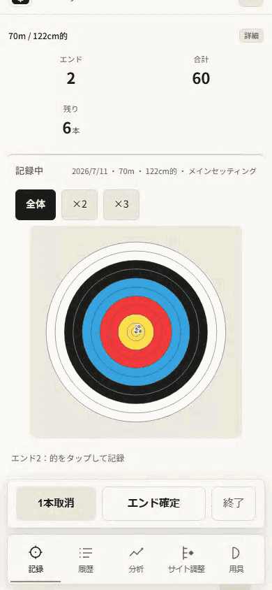
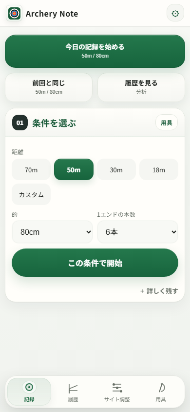
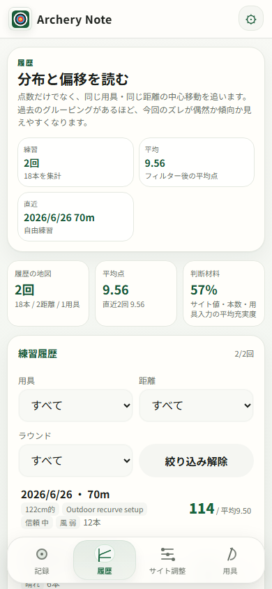
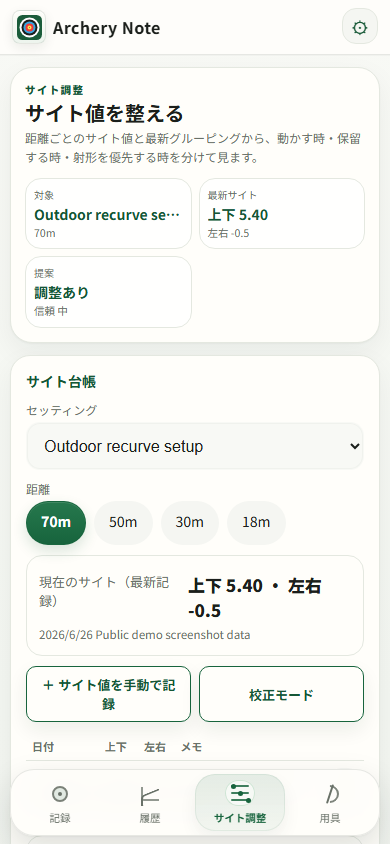
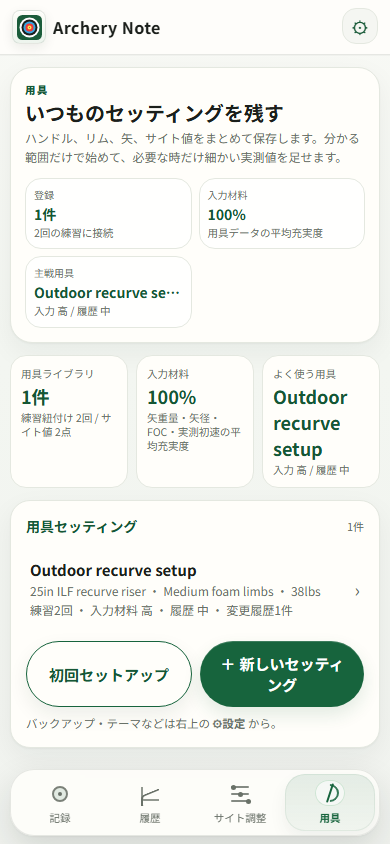

<div align="center">

# Archery Note

Archery Note is a mobile-first, offline practice notebook that turns scores, arrow groups, form and equipment records into an explainable next practice action. Practice data stays on the device; no analytics or account is required.

## Build Week growth coach

The Build Week branch adds a compact growth dashboard, 7/30/90-day and all-time views, evidence-bearing next-practice suggestions, and clearly fictional demo data that can be removed without touching personal records. See the [Build Week project description](docs/build-week/PROJECT_DESCRIPTION_EN.md), [Japanese description](docs/build-week/PROJECT_DESCRIPTION_JA.md), and [submission checklist](docs/build-week/SUBMISSION_CHECKLIST.md).

Public demo: **https://eita115115.github.io/archery-note/**

### How GPT-5.6 and Codex were used

Archery Note existed before the challenge. During the Build Week submission period, GPT-5.6 in Codex was used to inspect the existing architecture and Git history, challenge the product direction, design pure growth-analysis functions, implement the mobile dashboard, add deterministic and Playwright regression tests, review privacy and release boundaries, and prepare the submission evidence. The human product decisions were to keep the recording flow simple, compare each archer only with their own history, make every suggestion explainable, and preserve fully local processing. The dated commits and [development log](docs/build-week/CODEX_DEVELOPMENT_LOG.md) distinguish this extension from the pre-existing app.

**プライバシー重視のアーチェリー練習ノート PWA**
**Privacy-first archery practice notebook PWA**

[](LICENSE)
[](https://eita115115.github.io/archery-note/)
[](CHANGELOG.md)
[](#プライバシー--privacy)

[**Demo**](https://eita115115.github.io/archery-note/) | [Contributing](CONTRIBUTING.md) | [Security](SECURITY.md)

</div>

<div align="center">



_的をタップして得点入力 → エンド確定 → グルーピング分析 → サイト調整の提案_

</div>

## スクリーンショット / Screenshots

公開デモ上でサンプルデータを使って撮影したものです。

Captured from the public demo with sample local data.

| 記録 / Practice records                                    | 履歴 / History                           |
| ---------------------------------------------------------- | ---------------------------------------- |
|  |  |

| サイト調整 / Sight adjustment                              | 用具 / Equipment                             |
| ---------------------------------------------------------- | -------------------------------------------- |
|  |  |

---

## Archery Note とは / What is Archery Note?

得点・着弾位置・サイト値・用具・射形をひとつのアプリで管理し、練習後に「サイトを動かすか・保留するか」の判断材料を確認できるアーチェリー練習ノートです。アカウント不要、広告なし、データは端末から出ません。

An archery practice notebook that tracks scores, arrow impacts, sight marks, equipment, and shooting form in one place. No account needed, no ads, and your data never leaves your device.

---

## 主な機能 / Features

### 記録 / Recording

|     | 機能 / Feature   | 説明 / Description                                                                                                                             |
| --- | ---------------- | ---------------------------------------------------------------------------------------------------------------------------------------------- |
| 🎯  | **得点記録**     | 的面タップで着弾位置と得点を同時記録。ラインカッター自動判定 / Tap the target face to record impact and score. Automatic line-cutter detection |
| 📐  | **複数的面**     | シングル・トリプル・フィールドに対応 / Single, triple, and field face support                                                                  |
| 🔄  | **ラウンド対応** | フリー射ちに加え、複数距離ラウンドとステージ管理 / Free practice plus multi-distance rounds with stage tracking                                |
| 🌤️  | **天候記録**     | 練習時の天気・風向・風速をメモとして記録 / Weather, wind direction, and wind speed recorded per session                                        |

### 分析 / Analysis

|     | 機能 / Feature                   | 説明 / Description                                                                                                                                                              |
| --- | -------------------------------- | ------------------------------------------------------------------------------------------------------------------------------------------------------------------------------- |
| 📊  | **グルーピング解析**             | 中央値/MADベースの楕円フィットで外れ値を除外し、信頼度付きで算出 / Median/MAD-based ellipse fitting with outlier exclusion and a confidence score                               |
| 📈  | **トレンド分析**                 | 日別・週別・距離別・用具別の得点推移 / Score trends by day, week, distance, and equipment                                                                                       |
| 🔭  | **サイト調整**                   | 物理演算ベースの推奨値。空気密度・矢重量・標高を考慮 / Physics-based sight recommendations accounting for air density, arrow weight, and altitude                               |
| 🤖  | **AI射形トラッキング（ベータ）** | MediaPipe Poseによる端末内リアルタイム射形分析。7項目メトリクス＋フェーズ自動検出 / On-device real-time form analysis via MediaPipe Pose. 7 metrics + automatic phase detection |

### 用具・データ / Equipment & Data

|     | 機能 / Feature     | 説明 / Description                                                                                                                                                                                                              |
| --- | ------------------ | ------------------------------------------------------------------------------------------------------------------------------------------------------------------------------------------------------------------------------- |
| 🏹  | **用具管理**       | 弓・矢（EASTON X10, A/C/E 等のカタログ内蔵）・サイト・チューニング情報を一元管理 / Bow, arrows (built-in catalog: EASTON X10, A/C/E, etc.), sight, and tuning info                                                              |
| 💾  | **バックアップ**   | JSONバックアップ/復元、CSV出力 / JSON backup/restore, CSV export                                                                                                                                                                |
| 📴  | **オフライン対応** | Service Worker による完全オフライン動作。記録中とカメラ射形解析中は画面消灯を防止（対応ブラウザのみ）/ Full offline operation via Service Worker. Screen stays awake during recording and camera form capture (where supported) |

---

## AI 射形分析（ベータ）/ AI Form Tracking (Beta)

MediaPipe Pose の33ランドマークから、射形メトリクスをリアルタイム算出します。処理は全て端末内で完結し、映像がサーバーへ送信されることはありません。評価は「自分の過去の記録との比較」を基準にしており、撮影角度による測定誤差があるため毎回同じ角度で撮ることを推奨しています。既定でOFFのベータ機能です。

Real-time shooting form metrics are computed from MediaPipe Pose's 33 landmarks. All processing runs on-device -- video is never sent to a server. Scores are compared against your own past sessions rather than a fixed elite standard, since shooting angle affects measurement accuracy; the app recommends filming from a consistent angle. Off by default (beta).

| メトリクス / Metric            | 基準値 / Reference |
| ------------------------------ | ------------------ |
| 押し手角度 / Bow arm angle     | 172° (±9)          |
| 引き手角度 / Draw arm angle    | 152° (±14)         |
| 肩の落ち / Shoulder drop       | 0.072 (±0.056)     |
| アンカー位置 / Anchor position | 0.4 (±0.112)       |
| 頭のオフセット / Head offset   | 0.088 (±0.072)     |
| 体幹の傾き / Torso lean        | 0.21 (±0.045)      |
| 引き力線 / Draw force line     | 0.072 (±0.064)     |

**フェーズ自動検出 / Automatic phase detection:**
IDLE → SETUP → DRAWING → ANCHORING → FULL_DRAW → RELEASE → FOLLOW

カメラのフレームレートが15fps未満の端末では精度低下の警告を表示します。設定画面から検証用の診断データ保存（既定OFF）も選べます。

If the camera framerate drops below 15fps, the app shows a low-accuracy warning. An optional diagnostic-data setting (off by default) is available for field verification.

---

## クイックスタート / Quick Start

### ブラウザで使う / Use in browser

URLを開くだけで使えます。インストール不要です。

Just visit the URL. No installation needed.

> **https://eita115115.github.io/archery-note/**

ホーム画面に追加すると、ネイティブアプリのように動作します。

Add to home screen for a native app-like experience.

### ローカル開発 / Local development

```bash
npm install
npm run check:app
npm run check:ui
```

---

## 技術スタック / Technology Stack

| カテゴリ / Category       | 技術 / Technology                                                                        |
| ------------------------- | ---------------------------------------------------------------------------------------- |
| フロントエンド / Frontend | Vanilla JS (no framework), HTML, CSS                                                     |
| PWA                       | Service Worker, Web App Manifest                                                         |
| AI / 射形分析             | MediaPipe Pose (on-device)                                                               |
| 物理演算 / Physics        | 独自実装: 空気密度・弾道・サイト回帰 / Custom: air density, ballistics, sight regression |
| テスト / Testing          | Playwright (E2E), Lighthouse, カスタム検証ツール / custom validators                     |
| リンター / Linting        | ESLint, Prettier                                                                         |
| ネイティブ対応 / Native   | Capacitor (Android/iOS ready)                                                            |
| ホスティング / Hosting    | GitHub Pages                                                                             |

---

## プライバシー / Privacy

<table>
<tr><td>🔒</td><td><b>データは端末内に保存</b> / Data stays on your device</td></tr>
<tr><td>🚫</td><td><b>アカウント不要</b> / No account needed</td></tr>
<tr><td>🚫</td><td><b>広告なし</b> / No ads</td></tr>
<tr><td>🚫</td><td><b>トラッキングなし</b> / No tracking</td></tr>
<tr><td>🤖</td><td><b>AI処理も端末内</b> / AI runs on-device too</td></tr>
<tr><td>📡</td><td><b>GitHub Pagesはアプリ本体を配信するだけ</b> / GitHub Pages only serves the app itself</td></tr>
</table>

JSONバックアップ/復元とCSV出力に対応しています。ブラウザや端末のストレージを消すと、未バックアップの記録が失われる可能性があります。

JSON backup/restore and CSV export are supported. Clearing browser or device storage may result in the loss of unbacked-up records.

---

## コントリビュート / Contributing

貢献方法は [CONTRIBUTING.md](CONTRIBUTING.md) を参照してください。
See [CONTRIBUTING.md](CONTRIBUTING.md) for guidelines.

```bash
# 開発セットアップ / Development setup
npm install
npm run check:app
npm run check:ui
```

## セキュリティ / Security

脆弱性報告は [SECURITY.md](SECURITY.md) を参照してください。公開Issueには脆弱性の詳細を書かないでください。

See [SECURITY.md](SECURITY.md) for vulnerability reporting. Do not disclose vulnerability details in public issues.

---

## ライセンス / License

[Apache License 2.0](LICENSE)
</content>
