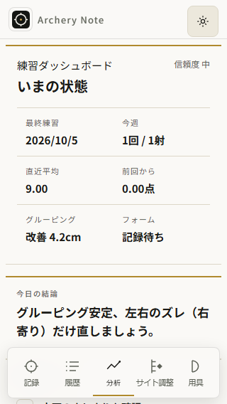
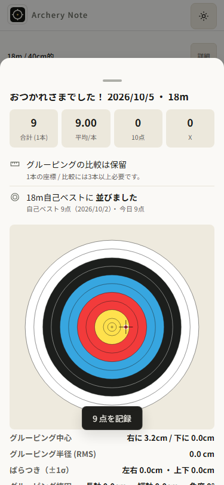

# 少数記録の分析表示を監査する — AN074

前回AN073は実公開110/更新/記録保持まで進捗。基点`9c6fc088c652a94e11759667bf966ecc21c08af9`、公開runtime/source`f967d12e96bdb113c8e1747236dcd3394d53f42d`。継続する大目標は、信頼できて日々使いたくなるアプリ。全承認継続、費用/個人情報不使用、所有架空fixtureのみ。

## 選択と範囲

1. **実Linux110の数値・表示・UIの経路を対照して優先修正点を決める**。採点と保存が一致するfixtureを使い、異なる画面が同じ記録をどう解釈しているかを比較する。採用。
2. dashboardのRMSだけを先に隠す。その他の結論や次回提案が同じ少数値を読む可能性を残すため、先に利用箇所を調べる。
3. 分析全体を作り直す。現在の計算/蓄積データ/利用経路を広く変えるため今回の範囲に入れない。

brainstorming/writing-plans/archery-note/diagnose/verificationを適用。Product gates: 得点・座標・履歴・分析のつながり、成長を誤読しないこと、完全local、毎回の判断に使えることを確認。ユーザーの包括承認に基づき再承認を要求しない。今回は一小タスクの監査であり、未再現の原因からruntimeを変更しない。

## 手順と完了条件

1. 現在のsource/版/acceptance/brief/currentprogress/history/continueとconsumerを読む。`sessionMetrics/robustStats`の値、`trHasGroupingEvidence/groupingSessionRow`の資格、dashboard/KPI/結論/提案/period/condition比較、PBの`avg-projected`/`exact-count`とrendererを対象にする。
2. 実CI110配布物（artifact11319403251）をlocal previewする。既存採点でscore/Xを生成した同条件旧3回を基準とし、新0/1/2/3/6本をChrome/WebKit320/375明暗で40ケース比較する。effective座標不足/数値文字列も補助観測に含め、旧履歴3件と数値を保つ。
3. 本数換算のbelow/tie/aboveと同本数の比較を実関数/rendererで分けて記録。値の丸めと文言を区別し、「推定の比較」を実記録更新と表示していないかを見る。
4. 少なくとも代表320/375明暗の実UIと、旧3履歴→native記録開始→1本入力/終了→結果→分析の経路を確認。raw tapはhit/rectを測り、score・座標・保存/reload・旧3を検証。DOMテキスト/pixel/数値のJSONを保存し代表画像を原寸表示する。
5. 失敗があれば元process/contextと観測を保持し、別成功へ置換しない。再現した不整合ごとに根拠/consumer/最小修正候補/必要回帰を記録する。3本は既存最低資格との整合であり統計的有意性の保証ではない。
6. 全app/scoring/math/UI/style/handlers/schema/deps/SWactivation/markers110不変、旧73task/allacceptance/sharedlockを確認。アプリ資産の実Linux/public25bytesを再照合する。docs/tasks/currentprogress/historyを更新し、format:check・独立readonly証拠レビュー後に監査だけを完了とする。runtime未変更なので新更新banner/新version/不必要なreleaseは作らない。修正とそのred→green受入は次の一小タスク。

実iPhone/VoiceOver/fullmotion/INP/GPU/巨大実履歴や未回復closedprofileの改善をこの監査から主張しない。監査出力は候補の根拠であって、未実装の修正の成功証拠ではない。

## 実行結果 — 監査のみ、修正は次のタスク

実CI110の配布物を所有loopback previewで実行した。公開25資産は再取得して全byte一致。sourceは引き続き`f967d12e96bdb113c8e1747236dcd3394d53f42d`、版110。記録/計算/画面/保存の監査を完了し、今回のapp変更・新releaseはない。

架空旧3回は18m/40cm/各6本、半径4.5cmの円周6点。得点は実`scoreAt`と`lineCutRadius`で生成した**全9点・54点**である。表示矢半径のラインカッターを含むため8点と推測しない。最新は0/1/2/3/6本、各点x3.2/y0/9点/Xfalse。Chrome/WebKit×320/375×明暗の40ケースで、全点の保存score/Xと実採点が一致、旧3/最新座標の保存/reload一致、pageerror0。

### 再現した表示の不整合

| 対象                | 実110での観測                                                                                                | 修正候補の境界                                                                                              |
| ------------------- | ------------------------------------------------------------------------------------------------------------ | ----------------------------------------------------------------------------------------------------------- |
| 1〜2座標のdashboard | RMS0、結果/履歴の比較資格falseなのに「改善4.2cm」(Chrome)/「改善4.3cm」(WebKit)                              | 最新と前回それぞれの座標資格を確認。少数最新を過去の改善として代用しない                                    |
| KPI                 | 最新/最小RMS0.0cmを表示                                                                                      | RMSだけ資格を揃え、平均点/最高合計/本数は維持。過去の対象を出す場合は「最新」と誤認させない                 |
| 今日の結論          | 1〜2本で「グルーピング安定、左右のズレ（右寄り）だけ直しましょう。」                                         | グルーピングの断定だけ保留し、得点の観測は維持                                                              |
| 次回提案            | 1〜2本で上下±0.0cmが左右±0.0cmより広いと指示                                                                 | 資格と表示精度を確認。`0 >= 0 * 1.3`で方向を断定しない                                                      |
| period/condition    | 最新1本のRMS0が平均へ混ざる。Chromeは旧4.203173404306163から3.1523800532296224へ低下                         | RMSの母集団だけ資格を揃える。回数/射数/得点の母集団は減らさない                                             |
| PBの本数換算        | 54点/6本を9点/1本に換算し、今回9点で「並びました」、10点で「更新(+1点)」。到達時に「推定・本数換算」が消える | 別タスクの表示修正。`avg-projected`の達成前後で比較方法と換算値を明示。`exact-count`と計算/同条件定義は維持 |

結果・履歴は既存`trHasGroupingEvidence`/`groupingSessionRow`により1〜2本を「比較は保留」とする。分析のfiniteチェックだけがこれと一致しない。n0は最新の有効得点記録から除外され、旧3の差0/横ばいになる。n3/n6は資格trueで、同一点のRMSは約4.44e−16。これらでも微小な左右ばらつきから「左右±0.0cmが上下±0.0cmより広い」と提案するため、丸め後ゼロの方向指示は本数不足と別の問題として残す。3本は既存最低資格との整合であり統計的有意性を保証しない。

実関数/rendererだけの補助probeはPB12件、座標4件。PBは1本と6本のbelow/tie/aboveを両engineで確認した。以下の表示は両engineで同じ。

| 比較                  | 今回            | 比較値 | 表示                                         |
| --------------------- | --------------- | ------ | -------------------------------------------- |
| 換算below             | 7点/1本         | 9点    | あと2点（推定・本数換算）                    |
| 換算tie               | 9点/1本         | 9点    | 並びました、換算注記なし                     |
| 換算above             | 10点/1本        | 9点    | 更新(+1点)、換算注記なし                     |
| 同本数below/tie/above | 42/54/60点・6本 | 54点   | あと12点/並びました/更新(+6点)、実合計の比較 |

過去の実最高合計は54点/6本のままである。換算tieを実最高合計9点への更新と扱わない。3得点行/2有限座標では得点27点を保ちながらstats.total/n=2、資格false、分析側は同じ誤解釈。数値文字列3座標は既存Number化でstats.total/n=3、資格true。補助probeはUI保存経路の証拠と混同しない。

### 原因の対照とsource

仮説の順位は(1)分析consumerの座標資格不足、(2)PB達成分岐の方法注記欠落、(3)表示丸めより小さい方向差、(4)cache/保存の古い値、(5)RMS計算自体の誤り。現在の関数と表示で1〜3を直接対照できた。corrected保存/reload一致は4を今回の不整合の説明として支持しない。1本RMS0自体は数式上の値で、5を理由に数学を変える証拠はない。

- `scripts/45-analysis-core.js`: growthDashboard77、nextPracticeSuggestions130、aggregateByPeriod196、conditionSplit345、todayConclusion388。RMSは有限値だけで採用、方向は比率だけで採用。
- `scripts/50-record-view.js`: analysisKpiHtml917/rrRows940、todaysResultPersonalBestRowHtml2170、groupingSessionRow2712。
- `scripts/49-todays-result.js`: trHasGroupingEvidence38、computePersonalBestDistance154。PBの`Math.round(bestAvg * curN)`、roundを除く同条件定義は今回変更しない。
- `scripts/40-analysis-physics.js`: sessionMetrics560。全得点と有限座標入力を分ける現処理は維持。

同じfixture/配布物の旧RMSはChrome4.203173404306163、WebKit4.267097959972327だった。約0.0639cmの差を観測したが、root cause/数学のバグを断定しない。本数不足の解釈不整合は両engineで再現しており、この差を直さなくても次の資格修正を検証できる。

### 実操作・検証器の失敗を区別する

初回監査は40表示の後、native375で1本記録→終了→結果→分析まで進み、reloadでassert失敗/exit1。初回`addInitScript`がreloadごとにfixture旧3を上書きした検証器の誤りであり、アプリのデータ消失とはしない。初回40件のreload flagsも上書きにより隠されていたため保存証拠として使わない。元失敗JSON/PNG/exit1と元process/contextを保持した。

所有Node inspectorで元contextのinitializerを特定し、Playwrightの公開Disposable.disposeで除去。元の消えたnative記録`muuixfr8mjdnz`は復元していない。同じ元contextで**別の新規記録**`muuj825f70w73`をnative入力→終了→結果→分析→reloadし、旧3+新矢完全一致/errors0を確認した。これは消えた元記録の回復ではない。breakpoint位置を誤った2helperは具体的な位置違いを確認して終了、観測timeoutを理由に元監査をrestartしていない。元監査のexit1も成功に書き換えない。

次にinitializerを「KEYがない時だけseed」へ訂正した独立の再検証がexit0。40matrixの保存/reload全件と、native375の新id`muuj90m5zfucz`/score9/Xfalse/旧3/結果保留→分析の誤解釈/保存reload一致/errors0を改めて確認した。実Browser/PWA更新やofflineの追加検証ではない。

元corrected matrixのWK375dark2のKPI PNGは空白を含む。実関数/DOMの値は残るが、そのPNGをKPI可読性の成功証拠にはしない。別owned fresh同条件probeはopacity1/visible/rect286〜395.34375/scroll577/animations0、2rAF後の実KPI0.0cmを原寸表示した。元閉じたcaseの回復や、空白の原因を断定していない。元空白画像も保管した。

### 保存した証拠と出力

Durable JSON: [matrix40](evidence/analysis-evidence-v110/matrix.json)、[native375](evidence/analysis-evidence-v110/native375.json)、[補助probe](evidence/analysis-evidence-v110/supplement.json)、[public25bytes](evidence/analysis-evidence-v110/public25-parity.json)、[初回失敗](evidence/analysis-evidence-v110/initial-failure-summary.json)、[同元contextの別新規記録](evidence/analysis-evidence-v110/retained-context-new-native.json)、[KPI fresh probe](evidence/analysis-evidence-v110/kpi-read.json)。fixture/コピーSHAも同directoryに保存。

原寸で確認した代表PNG11枚を`docs/screenshots/analysis-evidence-v110`へcopyし全byte一致。Chrome320明暗/WK375明暗dashboard4、KPI2（元空白含む）、history2、native結果/分析2、fresh WK375dark KPI1。全120matrix画像を目視したとはしない。




所有Node22.19で実行したraw harness/outputは`artifacts/analysis-evidence-v110`（ignored/local）。初回とcorrectedの両方を残す。

```text
audit.cjs (corrected), exit0:
PASS:40 actualLinux110 Chrome/WebKit fixture UI observations + native375 start/arrow/finish/analysis, score agreement/old3/reload/errors0; audit only, no app fix
supplement.cjs, exit0:
PASS:12 PB probes +4 coordinate probes, Chrome/WebKit/errors0; actualLinux110/public25 bytes exact; observations only, no app fix
kpi-read.cjs, exit0:
PASS: owned fresh WK375dark KPI render-state probe; original blank matrix image retained
preserve.cjs, corrected baseline check, exit0:
PASS: 20 evidence copies byte-identical (11 original-viewed PNGs,9 JSONs); original blank preserved
PASS: runtime/scoring/math/style/handlers/schema/deps/SW/markers110/tests unchanged vs notes+published source; old73 taskobjects/allacceptance/shared hiddenlock exact; corrected matrix40/native record preservation and score agreement
```

preserve初回のacceptance比較は、AN074が未commitのためplan08b855aの末尾AN073を誤参照してassert失敗した。実AN074の元acceptanceを固定し比較対象を訂正、旧73object/全acceptanceを確認。taskの条件は書き換えていない。

runtime不変なのでAN073の同source CI37247118554/Linux225passed(5.3m)/artifact11319403251を再利用する。今回fullE2E/checkall/lintを再実行したとはしない。今回の必須確認は監査・コピー/不変性・formatcheck・独立readonly review。formatとreviewの最終結果は確定後に記録する。

### 次の一小タスク

AN075候補: 分析でグルーピングを語るconsumerの最低座標資格を結果/履歴と揃える。rawstats、score/allrows、座標/採点/物理/保存cache/schemaを保ち、少数最新は比較保留。丸め後ゼロの方向提案も同じ根拠確認の対象。PB達成時の換算表示はその次の別修正。

回帰は0/1/2/3/6本、3得点/2座標、数値文字列、欠損/finite不備、同条件旧3、少数最新/少数前回、score-only変化、valid3+の従来値、正の方向差/丸めゼロ、period/conditionのscore母集団を含める。次回は今回の実110をred証拠にし、最小修正→green→320/375明暗Chrome/WebKit実UI/native保存→匹配する受入/checkall/lint/format/E2E/review→承認済み公開の順で行う。

費用/個人情報不使用。実phone/VoiceOver/fullmotion/INP/GPU/実射/巨大実履歴/WKstrictOffline/旧閉鎖profileの回復は未証明。大目標active、監査の完了を「愛されるアプリ」の達成や未実装のUX改善と扱わない。
