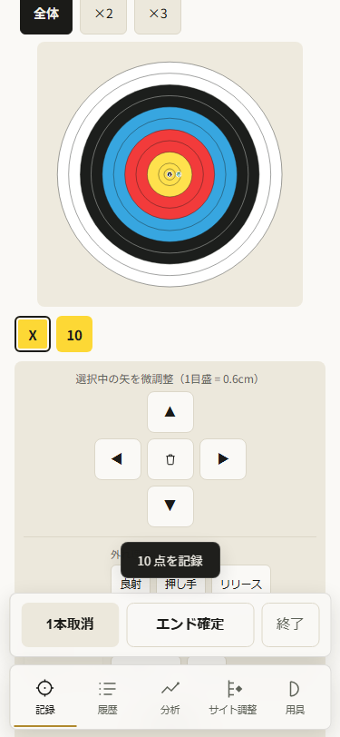
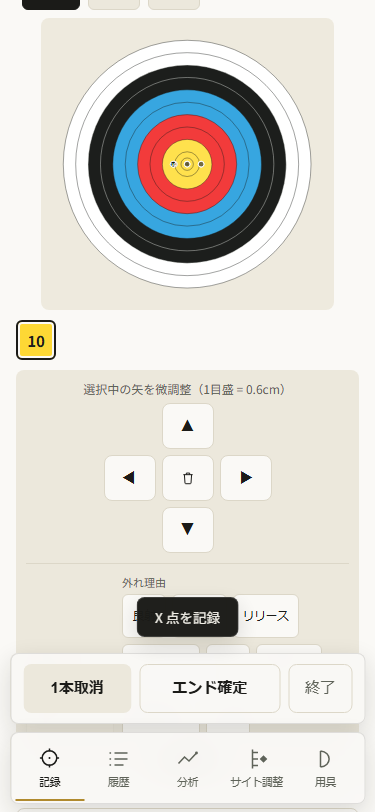

# AN-063 — 微調整ボタンの操作名

前run AN062は公開103の微調整入口を修正したprogress。今回はAN061の
記号だけの方向/名前なし削除という観察を、現在のruntimeで確かめて一件直す。
既存の全承認で実装/公開まで進める。費用・個人情報は使わない。

## 設計と計画

現在sourceのnpadは▲/◀/▶/▼とtrash SVGだけ。方向の記号だけでは
読み上げ時に矢の修正操作と分からず、削除はaccessible nameがない。
既存の「選択中の矢を微調整」の文脈に合わせ、日本語のaria-labelを付ける。
五ボタンを「選択中の矢の微調整」というgroupにし、native button操作を保つ。
type=buttonを明示する。配置/寸法/見える記号/handler/scroll/保存/採点は変えない。

常時五つの長い文を表示すると小さい操作パッドが崩れる。titleだけでは
touchや読み上げで安定した操作名にならないので、aria-labelを採用する。
矢の番号や移動量を動的に名前へ含める変更は今回含めない。

4gate: 修正した記録を履歴/分析へ繋ぎ、成長データを保持し、local処理を保ち、
日々の修正を読み上げ/keyboardから理解しやすくする。新規独立機能はない。
既存全承認の範囲なので再承認は求めない。自己レビューで名前/動作/範囲を確認した。

1. 所有headless runtimeのAX snapshotで旧group/五ボタンの名前を保存する。
   名前によるlocatorを使う回帰を320/375で追加し、現行の失敗を確認する。
2. scripts/50-record-view.jsのnpad markupだけに操作名を付ける。
   四方向をkeyboard Enter/Spaceで操作し、座標/score/保存/選択中の矢の削除と
   他の矢/既存history保持を確認する。375前後画像/AXを保存する。
3. owned compact-js sandbox/isolatedNode22.19で全check/lint/format/生成E2E、
   Chrome/WebKit320/375記録/修正/確定/次矢/設定swipe/offline。root/original
   node_modules junctionにはinstall/ci/updateしない。read-only reviewで確認する。
4. markersを揃えた次版を公開する。driver/candidateを準備してから実公開103の
   normalcache600 profileを保持して通常push。realbanner初回15body/14cacheと
   practice exact、実操作/offlineを保存し、正確LinuxCI/25publicbytesを照合する。
5. 完了後のみAN063/progress/ledgerに証拠を追加する。既存task acceptanceは保つ。

受入はevals/acceptance.mdのUI/check:ui/lint/375前後、release全check/E2E/format/
version/PWA。実VoiceOver/物理iPhone/全motionフレーム/実INPは証明しない。
旧WK offline/lifecycle/失敗profileの限界は保全する。

## 実受入 — 公開v104 / 2026-10-04

source 88b33445cfdcd99f54db6fd390ef32b8ee75ffd9; CI37186782681 validate/deploy success, actual Linux artifact11297261198, all25 public assets and saved held first-document15/canonical14 match. Owned check:all/lint/format success; raw AX old symbolic directions/unnamed delete and named group red2 failed retained, focused2 passed (5.9s), final generated 149 passed (2.0m), Linux 149 passed (3.2m). Named group/five controls in native Chrome/WebKit320/375 AX; keyboard Enter/Space checks direction vectors/score/other-arrow retention/selected deletion/save/reload on320/375. Pad geometry/native touch/scroll retained; six-arrow correction/end/next/offline/history3/active1/errors0. Actual held public103→104 normalcache600 realbanner in 287551ms, firstAPP104/cache104only/practice5 exact, settings touch swipe/target native pinch guard/offline/history5/end6/active1/errors0; fresh public375 same operation success. Markup only names/group/type; scoring/schema/dependency graph/SW activation/visual arrangement unchanged. docs/codex/correction-control-names.md; artifacts/release-v104. Real iPhone/VoiceOver/Tab order/intermediate keyboard-save/performance unverified; WK multitouch synthetic and offline via actual origin stop.

[公開CI37186782681](https://github.com/eita115115/archery-note/actions/runs/37186782681)。正確source Linux出力/終了status/artifactを保存。所有sandboxのnpm scriptsによる実出力:

```text
Archery Note checks OK (v104)
check-globals OK (14 files, 1240 unresolved refs all accounted for)
Analysis core characterization checks OK
Robust median reuse checks OK
Form core checks OK
Form metric fixture checks OK
Form diagnostic checks OK
Gamification pure-function checks OK (streak / 12 badges / backfill / goals)
Todays-result pure-function checks OK (weeklyDiff / stabilityTrend / personalBest / growthStreaks)
Security regression: all 38 checks passed
UI smoke checks OK (chrome.exe)
PWA asset checks OK
PWA update flow checks OK
Storage contract checks OK
Storage round-trip checks OK
Save debounce checks OK
Version alignment checks OK
Distribution checks passed:14 structures/names/order/source/regeneration; gzip JS 196662→139330 bytes; cross-script fixtures
149 passed (2.0m)
149 passed (3.2m) (Linux CI)
All matched files use Prettier code style!
lint: exit 0 (lint.txt)
PASS:all25 public104 assets byte-identical to actual Linux artifact; saved actual held103→104 first-document15 and canonical14 hashes match Linux
```

旧previewのAXはregression-red.txtに保持: ▲/◀/▶/▼と名前のないbutton/img。名前付きgroupが0件で320/375とも2 failed、terminal1。markup修正後のfocused2 passed (5.9s)、最終sourceの149テストにも含めた。設置場所や見える記号は同じ375px画像で目視した。前画像は旧source103の所有preview、後画像は最終source104の生成物テスト、public画像/AXは実公開104の所有profile。






実公開AX（fresh-deployed.json/public-correction-ax.txt）:

```text
- group "選択中の矢の微調整":
  - button "選択中の矢を上に微調整": ▲
  - button "選択中の矢を左に微調整": ◀
  - button "選択中の矢を削除":
    - img
  - button "選択中の矢を右に微調整": ▶
  - button "選択中の矢を下に微調整": ▼
```

read-only reviewでP1/P2なし。keyboard testは直接focusしてEnter/Spaceを送るのでTab順序/実VoiceOverの証拠ではない。四方向は元座標へ戻り、保存チェック単独では中間の全keyboard座標の永続化を証明しない。別のnative3nudge probeで変更座標の通常debounce保存/offline reloadを確認した。

parity-initial-label.txtの成功メッセージには旧helper由来のheld102という誤表記があった。
実保持JSONのfromは103、候補104/sourceと25bytes/hash照合は正しかった。
所有helperの表示をheld103→104へ直し、parity.txtを再取得した。アプリsourceは変更していない。

rehearsal/complete-update.jsonはpublic:falseで実公開受入に数えない。実保持更新はlive/immediate-update.json/complete-update.json、fresh publicはfresh-deployed.json、全25一致はlive-parity.json。nativeChrome二本指、WKは合成複数指/native単指、WKofflineは実origin停止の意味を保つ。旧98/99profile失敗、WK setOffline/lifecycle失敗は旧受入/progressに残す。実iPhone/VoiceOver/keyboard viewport/INP/5000件/全motionフレームは未確認。
