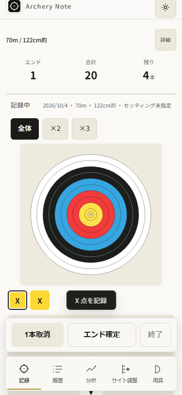
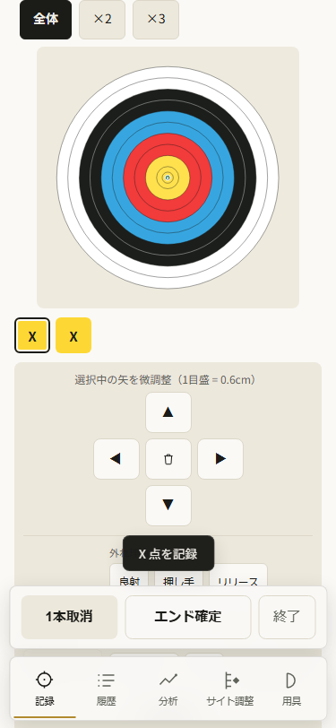

# AN-062 — 矢を選んだら微調整をすぐ使える

前run AN061は実公開のUX監査で新しい摩擦を確認したprogress。
今回は既存の全承認に基づき一件だけ直す。料金・個人情報は使わない。
正本の記録/初回ガイド/終了結果の構成は広く書き換えない。

## 設計

選択した矢の微調整パッドを、そのチップを押した時だけ見える位置へ出す。
既存の `refreshActive` がパッドとタグを表示した後に位置を測る。
通常の矢入力、連続nudge、理由タグ、矢番号の入力には新しいscrollを入れない。
選択解除/削除/確定後の `revealActiveTarget` は保全する。

操作パッドの五つのボタンがヘッダーとドックの間に収まるよう必要量だけ
instant scrollする。既存のパッド入場モーション6pxも見越して16px余白を取る。
収まっていれば動かさない。small phoneでも150pxパッドを押せる。
content-visibilityによる仮の位置を測らないよう、対象カードを測定前にレイアウトする。
新しいモーション・listener・timer・永続キーは追加しない。

候補の375画像で記録通知がパッドの▼を覆うことを確認した。
通知はpointer-events:noneでhit-testが通るため、指で押せるだけでは視認性の証拠にならない。
表示中の通知も操作領域の下端として扱い、通知のtransformを含まない固定layout位置から測る。
通知の非表示・内容・時刻は変更しない。重なりの追加redを残してから直す。

監査で検討した常設位置の変更は通常の的を狭め、理由を折りたたむだけでは
パッドの上端がドック下にある問題を解決しない。選択時だけ出す案を採用する。
チップ選択による視点移動はあるが、必要な操作へすぐ届く。

4gate: 修正した記録が履歴/分析へ繋がり、成長データを正しく残し、処理はlocal、
毎日の修正に追加操作を求めない。self-reviewで契機/位置/動かさない条件を確認した。
既存の承認が実装・公開を含むため、同じ承認を再度求めず進める。

## 実装と受入の順序

1. `tests/e2e/correction-entry.spec.js`: 320/375、light/dark、normal/reducedで
   チップをnative touchで選択し、五ボタンの位置とhit-testをscrollなしで検証する。
   現行版でドックに隠れるredを残し、単なるPlaywright自動scrollで合格にしない。
2. `scripts/50-record-view.js`: チップ選択handlerだけから必要な表示位置調整を呼ぶ。
   nudge/タグ/番号入力中のscroll保持、採点円、解除/確定/次矢、架空保存を回帰で確認する。
3. 所有compact-js sandbox/isolatedNode22.19で全check/lint/format/実生成物E2E。
   nativeChrome/WebKit320/375の主要操作/設定swipe/offlineを確認し、375前後画像を表示する。
   root/original node_modules junctionのinstall/ci/updateは禁止。
4. read-only review、揃えた版markers、事前候補/driver準備後に通常承認済みpush。
   実保持公開旧profileのrealbanner初回code/15body/14cache/practiceを即時保存し、
   追加scroll不要の修正/確定/次矢/設定swipe/実offlineを確認する。
   正確source LinuxCI/25publicbytesと保存hashを照合する。
5. 全証拠が揃ってからAN062/progress/ledgerを更新する。既存task acceptanceは変えない。
   WebKit合成複数指、旧offline/lifecycle失敗、実iPhone/VoiceOver/INP未確認は維持する。

採点の円とscore、既存practice、保存schema、依存graph、SW activationは変更しない。
共有hiddenlock SHA256 `16F9BA6219DA31278CED98C0C742013B4A5AAEA63059E4702E86756702A23309` を保持する。

## 実受入 — 公開v103 / 2026-10-04

source e3f1e2e4ac5e1e80a1a8a137f1010b74074c6a20; CI37164343275 validate/deploy success, actual Linux github-pages artifact11288562755, all25 public bytes/held first-document15/canonical14 match. Owned check:all/lint/format success; second-selection regression red and visible-toast overlap red retained, final focused8 passed (1.2m), generated 147 passed (2.0m); Linux 147 passed (3.3m). Chrome/WebKit native single-touch320/375 correction pad five buttons visible above dock/toast with no manual scroll, 3 nudges preserve scroll and score circle, deselect restores target, normal debounced save completes; correction/end/next/offline retains3 histories/end6/active1/errors0. Actual held public102→103 realbanner within 292782ms normalHTTPcache600, initialAPP103/cache103only/practice5exact, native multitouch protection, correction entry/end/next/settings touch-swipe/browser offline SWreload/history5/end6/active1/errors0. Fresh public375 same entry/record/offline success. Matched375 before/after images retained. Scoring/storage schema/dependency graph/SW activation unchanged. docs/codex/correction-entry.md; artifacts/release-v103. WebKit multitouch synthetic; real iPhone/keyboard/VoiceOver/INP and all animation frames unverified.

公開CI: [37164343275](https://github.com/eita115115/archery-note/actions/runs/37164343275)。正確sourceのci-linux.txt/ci-status.jsonとartifactを保存。所有sandboxのnpm scriptsは次の実出力。

```text
Archery Note checks OK (v103)
check-globals OK (14 files, 1240 unresolved refs all accounted for)
Analysis core characterization checks OK
Robust median reuse checks OK
Form core checks OK
Form metric fixture checks OK
Form diagnostic checks OK
Gamification pure-function checks OK (streak / 12 badges / backfill / goals)
Todays-result pure-function checks OK (weeklyDiff / stabilityTrend / personalBest / growthStreaks)
Security regression: all 38 checks passed
UI smoke checks OK (chrome.exe)
PWA asset checks OK
PWA update flow checks OK
Storage contract checks OK
Storage round-trip checks OK
Save debounce checks OK
Version alignment checks OK
Distribution checks passed:14 structures/names/order/source/regeneration; gzip JS 196600→139260 bytes; cross-script fixtures
147 passed (2.0m)
147 passed (3.3m) (Linux CI)
All matched files use Prettier code style!
lint: exit 0 (lint-final.txt)
PASS:all25 public103 assets byte-identical to actual Linux artifact; saved actual held102→103 first-document15 and canonical14 hashes match Linux
```

UI受入の375px前後は同じ70m/122cm/6本条件と二本の架空矢でnativeチップ選択直後を撮った。旧版は実Linux102、新版は凍結source103。追加manual scrollなし。両画像を表示して確認した。






失敗と限界は保持: regression-red.txt/regression-red-confirmed.txtは二回目の選択の下端403.47>379（before-320画像は初回選択なので失敗の唯一の証拠にはしない）。初候補244c263の8/147成功でも375画像の通知が▼を覆い、pointer-events:noneでhit-testだけが通っていた。notice-red.txtはprobe変数scopeのReferenceError、notice-red-confirmed.txtは実重なり355.47>323を検出。最終notice-green.txtは8 passed (1.2m)。initial候補/画像/ログを残した。

prepare-failure.txt/rehearsal.txt/mobile-transport.txtは所有helperパスの二重置換によるENOENTで、修正後に再実行。mobile-transport-confirmed.txtのWK320失敗は新しい3nudgeの通常debounce保存を待たずに旧localStorage.activeを比較したprobe問題で、保存完了pollを足した最終mobile-transport-final.txt/matrix4行は成功。手動save/flushで合格にしていない。比較serverのSVG MIMEを正した再撮影はapp source変更なし。

localリハーサルrehearsal-final/complete-update.jsonはpublic:false。実公開はlive/immediate-update.json/complete-update.json、fresh-deployed.json、live-parity.json。後者だけを公開受入とする。read-only reviewはP1/P2なし。normal motionの全フレームや実iPhone keyboard/VoiceOver/INPは未確認。旧offline/lifecycle/profile失敗はprogress/旧受入に維持する。
