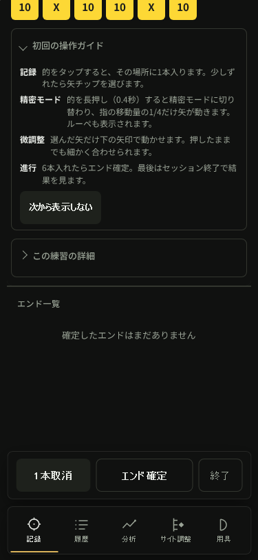
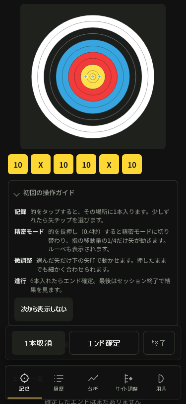

# Correction return — AN-049 design and plan

Restore a usable target after leaving arrow correction and after confirming an
end. Keep ordinary refresh, metadata input, tab reading positions, scoring and
storage unchanged. Existing broad human approval covers this bounded UX fix.

Observed immutablev96 WebKit375 trace: selection starts at scrollY14, manually
revealing right nudge moves to422, revealing deselect moves to727. Closing the
426px correction panel clamps scrollY to623, targettop-313/bottom-20.6875. First
end confirmation leaves targettop-309. No application scroll occurs on either
return path. revealChipsAboveDock only handles chips below the fixed dock; it
cannot bring an above-viewport target back. Browser height clamping differs by
engine, which explains why the prior survey showed this in WebKit375. Actual
browser scroll anchoring internals are not established or needed for the fix.

Alternatives: remember the pre-correction offset (additional state/stale restoration
risks), reset the whole page (unnecessary movement), or reveal the target within
the available viewport only at explicit recording-return boundaries (chosen).
Use current header/dock bounds, instant minimal movement and stable target-card
layout. Do not move focus or scroll during ongoing correction or metadata input.
An oversized target should align its top to the usable band rather than oscillate.

This maintains existing record/analysis connections and readable growth data,
fully local processing and a less interrupted daily recording flow; it introduces
no standalone feature or growth claim. No fee, telemetry or personal records.

Plan:

1. Add public-interaction regression: six actual touch placements, manual reveal
   for correction, nudge, return without manual target recovery, confirm and add
   next-end arrow. Check saved arrow coordinates/score, old sessions and reload.
   Verify the original implementation fails for target bounds, not helper setup.
2. Add a focused target reveal helper in scripts/50-record-view.js. Invoke after
   correction closes and successful end confirmation; ordinary refresh stays put.
3. Verify Chromium/WebKit320/375 normal/reduced motion, deselect/chip toggle/delete,
   confirmation from a selected arrow, and related end/record/tab checks. Keep
   current375 before/after PNG evidence, app/UI/globals/lint/format outputs.
4. Read-only review, preserve old task acceptance, update progress/tasks/history
   and commit locally. Version/full release acceptance follows separately under
   the existing approval; publicv96 is unchanged by this local task.

Self-review: one behavior, known paths, no placeholders, no schema/score changes.
Required command/output and actual-phone limits are recorded in the final section
once executed. Physical iPhone/keyboard/VoiceOver remains unverified.

## Implementation and evidence so far

The helper uses current SVG/header/dock bounds with8px clearance and keeps only
the target card laid out so an offscreen placeholder cannot shift after the
measurement. It runs on correction-open→closed and successful end confirmation.
There is no focus change, scoring change, storage change or new dependency.

The initial regression detects more than the zero-visible-height survey criterion:
six contexts fail because the target is partly/fully above the viewport; two
Chromium375 contexts already pass. This test deliberately requires the whole
target to be usable when it fits. Red:6failed/2passed (1.2m), not an all-browser
complete-disappearance claim. First corrected matrix:8passed (1.3m).





These current-run paired images show the same normal-motion6-arrow deselect point.
Both are retained exact output copies and visually inspected. Full-target return
is the scope; toast placement and field labels remain separate AN-050/051 tasks.

Retained helper/setup issues: a sandbox copy used the wrong working-directory
relative destination and failed. That test process was interrupted through its
live handle13918, source copied correctly from the root, listener8753 absent,
then the actual green matrix ran (handle64546 completed). No untested app change
was called a pass. A later patch attempt mismatched Prettier's parentheses and
made no edits; current lines were read before successful patching.

Additional exit-path tests initially sampled localStorage immediately after the
last touchscreen arrow, before its scheduled persistence. Reload flushed the
arrow, so expected cur=[] versus restored cur=[arrow] was a verifier race, not
data loss. The helper now polls for the final persisted count as on all prior
placements. The failed expanded run is retained, and corrected exit-path results
will be recorded below after completion.

The first corrected expanded run passed normal motion but4reduced-motion cases
still captured second=[] before the newly placed arrow persisted. The same wait
omission existed at another new placement, not at a new runtime path. Persistence
count polling now lives in recordArrow itself so every placement completes before
any subsequent snapshot or action, with explicit per-step counts also retained.
expanded-corrected.txt4failed/4passed (1.6m) is historical, not a success claim.

Initial independent read-only review found no actionable code issue and confirmed
trigger scope, current bounds and focus/scoring/storage isolation. At that review
the first8-case outcome and extra exit paths had not been inspected; final evidence
review remains pending. Existing app/globals/UI/lint checks passed for runtime
source; their output and final expanded-test result are recorded below.

## Final acceptance

```text
6 failed / 2 passed (1.2m) — original target-bounds regression
8 passed (1.3m) — first corrected deselect matrix
8 passed (1.7m) — final expanded matrix
20 passed (2.5m log) — related record/end/tab tests; that run also retained8verifier failures
Archery Note checks OK (v96)
UI smoke checks OK (chrome.exe)
check-globals OK (14 files, 1225 unresolved refs all accounted for)
npm run lint — exit0
All matched files use Prettier code style!
```

Final8 spans Chromium/WebKit320×568light and375×812dark, normal/reduced motion.
Six touch placements, nudge, deselect, first end, next placement, ongoing nudge and
reason immediate scrollY stable, chip toggle off, selected deletion, direct selected
confirmation, next placement, active record tab return120, original sessions and
active reload retained, errors0. Public conditions/navigation use locators; arrows
and correction/actions use screen coordinates. Manual scroll is simulated only for
secondary correction controls, never to recover the target. Whole-target bounds
are asserted after each exit and confirm. Non-jump checks are immediate scrollY,
not arbitrary delayed movement or real keyboard assurance.

Runtime source remains the same as first green. Later failures were persistence
sampling omissions in new helper actions, corrected centrally for every placement.
The20 related cases are reused for that unchanged runtime; repeated broad testing
is deferred to release acceptance. Before/after375 outputs were viewed and retained.
No physical iPhone/VoiceOver, full storage schema/scoring-boundary coverage or
community preference claim follows from these headless checks.

Raw artifacts: trace-after-end.json under artifacts/phone-end-flow/trace;
artifacts/correction-return/red.txt, green.txt, expanded-first-failure.txt,
expanded-corrected.txt (4failed/4passed), expanded-final.txt, check-app.txt,
check-ui.txt, check-globals.txt, lint-final.txt and format-final.txt. The interrupted
green-initial.txt is not acceptance evidence. Final review and source/record audit
are recorded below.

## Final review and record audit

Independent read-only final review found no additional issue. The prior P2
persistence-wait finding is resolved centrally, all8 exit-path cases finish,
and related20 remain valid for the unchanged runtime. No physical/keyboard or
arbitrary delayed-movement guarantee. AN-049 local completion and AN-052 pending
release are consistent. No review-side test execution or mutation.

```text
PASS: final8/related20 evidence and retained failures; original task acceptance preserved; scorer/storage/version/dependencies unchanged; target-return scope only; live candidate85 frozen; after375 image exact final output
PASS: 102 candidate source/test/dependency files match owned sandbox; shared hidden lock unchanged
All matched files use Prettier code style!
```

The final375 image was refreshed from the final expanded run, copied exactly and
viewed again. Owned browser/test handles are terminal and loopback8753 has no
listener. The implementation is saved locally; publicv96 remains unchanged.
