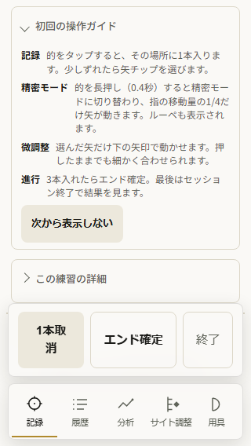
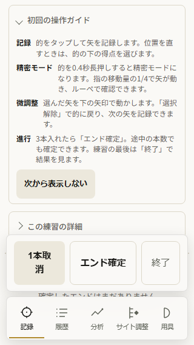
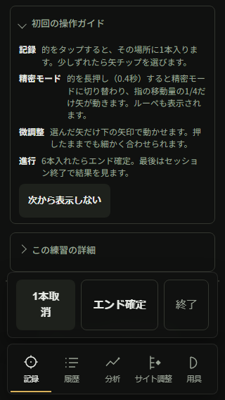
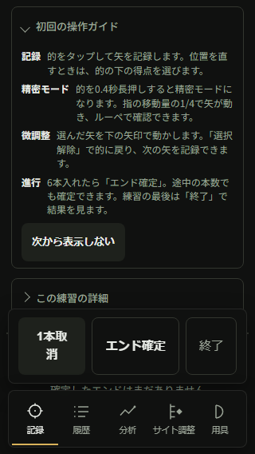
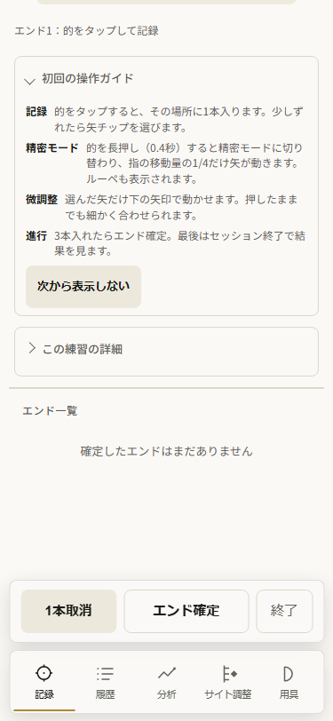
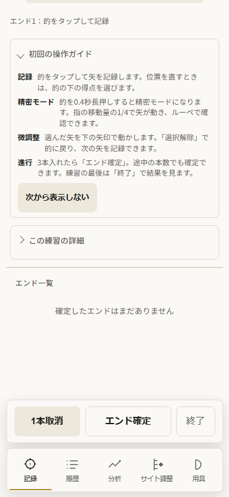
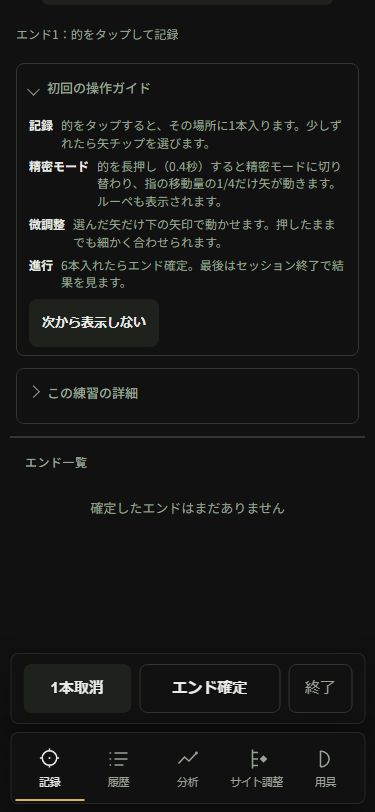
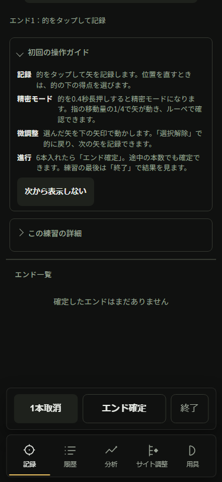
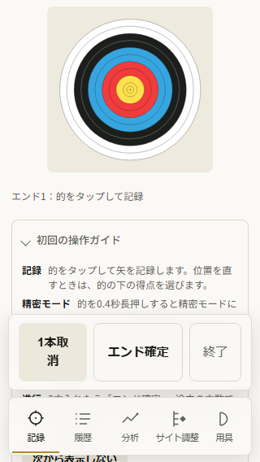
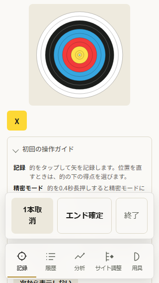

# 初回ガイドを実際の操作に合わせる

AN069。開始位置を直した公開v106/AN068を基点に、AN067で見つかった案内のずれを一件として直す。所有worktreeの5daf588aはclean、公開mainは74f1a22d。既存の全承認に沿う文章修正で、費用や個人情報を使わない。

## 設計と比較

| 案                               | 判断                                                           |
| -------------------------------- | -------------------------------------------------------------- |
| 既存の折りたたみガイドを直す     | 採用。いつもの記録画面から使え、操作と同じ呼び名で説明できる。 |
| 的の近くに常設メッセージを増やす | 的と入力を囲む説明が増えるため採らない。                       |
| 別のチュートリアル画面を作る     | 練習開始までの移動を増やすため採らない。                       |

四つのproduct gates: 記録→履歴/集計/サイト判断の既存経路を案内する。正しく矢を残して継続比較の材料を作り、成長を見えるようにする。全処理を端末内に保つ。日々の選択解除/エンド確定/終了の迷いを減らす。新しい独立機能ではなく、既存経路の案内修正。

activeGuideHtmlの四行を具体的にする。的の下の得点を選んで矢の位置を直せること、微調整後の「選択解除」、規定本数未満でも「エンド確定」できること、結果は「終了」で見られることを明記。0.4秒/移動量1/4/ルーペの精密操作は現実装どおりに残す。npadはonclickだけなので、矢印を押し続ける説明は削る。

表示済みflag・折りたたみ・次から表示しない・的/操作列・採点/保存・styleは変えない。初回ガイドはdetails内のまま。文章の高さを実画像で確認し、増えすぎる場合は文章を短くする。

## 計画と完了条件

1. 所有架空profileの生成v106で320/375 light/dark・3/6本のガイドを表示し、原寸画像/DOM/実操作を保存する。
2. scripts/50-record-view.jsの四つの案内文だけを直す。prose修正なのでliteralをなぞる新規テストは書かない。
3. 同条件の前後画像を保存・表示して読みやすさ/横overflow/得点選択/微調整/選択解除/partial確定/終了/表示抑制/reload・旧履歴保持を確かめる。既存の記録回帰を利用する。
4. 揃えたversionをbump、check:all/lint/format/生成dist全E2E、read-only review。承認済み公開版のCI・25資産・所有旧profile更新とoffline保持を確認する。
5. 証拠をこの文書とartifacts/first-guide-v107へ保存し、progress/tasks/ledgerを更新。既存68task/全69acceptanceを保つ。

設計のself-review: 未定のラベル/APIなし。sourceの0.4秒/0.25、nudgeDone、bEnd、bFinish/finishSessionを読取済み。bEndはcur.lengthが1以上なら確定できる。実機iPhone/VoiceOver/全motion frame/INP、微調整下端の別候補やRMS少数矢表示はこのタスクで解決したとしない。承認済み実行としてwriting-plansの短い計画から継続する。

## 生成プレビューの前後確認

版bump前の生成v106で各8ケースを実行。320/375・light/dark・3/6本、フォントreadyとanimation完了を待って採取。横overflowなし、的の初期表示を保持。native入力→得点選択→右微調整→選択解除→1本だけのエンド確定→次から表示しない→reload→終了→次の開始とreloadまで成功。各ケースで旧架空3件を全field保持、新しい確定1本の座標も保持。非表示flagはreloadと次の開始でも保持、pageerror空。

各phaseのDOM/geometry/架空保存状態はartifacts/first-guide-v107/{before,after}/evidence.json、出力はbefore.txt/after.txt。画像32枚（top/bottom各8×前後）は同run実ファイル。以下の代表8枚を原寸で表示・目視し、byte同一copy。320のガイドもボタンまでdock上で読める。375の高さは変わらず、320は一行分増える範囲で折り返す。全32枚を目視したとは扱わない。

















これは案内文の修正なので、新規literal回帰テストやred失敗を作らない。元の操作は前後とも成功する対照であり、操作の新機能や速度改善を示すものではない。公開受入は次に追記する。

## 公開と検証

公開v107/source `4eeecf634e9fae977f112685d6bb7f803783518a`。[CI37222538203](https://github.com/eita115115/archery-note/actions/runs/37222538203) validate/deploy成功、実Linux artifact11310289226。公開/実Linux25資産、実保持更新のfirst-document15body/canonical14scriptはbyte exact一致。read-only reviewでP1/P2指摘なし。全出力はartifacts/first-guide-v107、抜粋は以下。

```text
npm run check:all
Archery Note checks OK (v107)
UI smoke checks OK (chrome.exe)
PWA asset checks OK
PWA update flow checks OK
Storage contract checks OK
Storage round-trip checks OK
Save debounce checks OK
Version alignment checks OK
Distribution checks passed:14 structures/names/order/source/regeneration; gzip JS 196671→139328 bytes; cross-script fixtures

npm run lint
> eslint "*.js" "scripts/**/*.js" "tools/**/*.js" "tests/**/*.js" "eslint.config.mjs"
(exit 0)

npm run format:check
All matched files use Prettier code style!

npm run test:e2e:dist
170 passed (2.1m)

Actual Linux CI
170 passed (3.2m)

PASS:before eight generated mobile guide flows
PASS:after eight generated mobile guide flows
PASS: same real public106→107 context, active update blocked/native finish/old4 retained, 320 newstart first native arrow, offline SWreload exact
PASS:all25 actual Linux/public107 assets byte-identical; all15 held-update first-document warm bodies match Linux
```

公開106で架空3履歴＋native1矢を持った元contextを維持。記録中の更新block→native終了→4履歴の全fieldを保持。15資産を通常600秒cacheでwarmし、残freshness内の公開反映288314ms、更新完了後のcheckpointまで292527ms。banner更新後107/cache107only、practice4全field exact。続けて320でnative開始→全的表示→中心tap一回、旧4＋active1のoffline SWreload一致。errors空、context/browserは完了後に閉じた。local予行も同じ保護/操作/保持に成功。

AN068のpredicateが新documentでAPP_VERを早く読む検証側失敗を踏まえ、今回の検証predicateはtypeof確認後に版を比較する。保存読取はpollで待ち、元fixture参照は失敗時の診断用に保持する。アプリのupdate/保存/activation処理は変えない。今回のrunに失敗/context再作成/再tapはなく、AN068の失敗証拠は別に保持する。

公開の二枚も原寸で保存・表示・目視してbyte同一copy（代表guide8枚と合わせ10枚）。初期画面の主役は的のためガイドの下半分はfold外。全ガイドの文字と横overflowは上記owned生成プレビューの読み位置で確認した。公開画面で全guideを表示したとの主張はしない。





次の一件候補: 少数矢でRMS改善を強調する表示を診断する。AN067の1本RMS0の観測と現sourceを照合し、本数/比較条件/既存confidenceの境界を確認してから対処を選ぶ。数学の値と改善の解釈を混同しない。実機iPhone/VoiceOver/INP、微調整下端や古い公開失敗profile/WKofflineの受入は未確認、大目標はactive。
