# AN-067 — 初回記録ガイドから終了までの公開UX監査

最優先は、条件を指定して開始した直後に的を操作できる位置へ戻すこと。
320×568の実操作では開始後もscrollY416.67が残り、的の上半分が画面外になった。
手動で上へ戻せば入力できたが、開始後の余分な一手を利用者に要求している。
今回は監査だけ。アプリの動作を修正したとは扱わない。

## 対象と証拠

- 公開 https://eita115115.github.io/archery-note/ のv105。同じ所有IAB tabで取得した22画像だけを使用。
- 初回操作ガイドがまだ表示される既存の所有架空profile。新規welcome/onboardingの監査ではない。
- 論理viewportは375×812/320×568、保存JPEGは365×790/310×550。両者の座標を混同しない。
- 18m/40cm的/3本設定。375で3本・30点を確定/終了、320で1本・10点を確定/終了。
- CUAのUI操作と実DOM/AXを使う。精密モードの実長押し・物理タッチ・VoiceOverの試験ではない。
- 画像は保存したbytesを読み直して表示・目視した。原本/notes/geometry/SHAは`artifacts/first-guide-v105`。
- DOM14script URLsは全て?v=105。current source/公開mainは06e27752のアプリと同じ。
- reload前後で履歴7回/28本の表示リスト全文が一致。DB全フィールドのexact検証やoffline試験ではない。
- データreset/delete、次からガイドを表示しない操作、外部送信、費用・個人情報の使用はなし。

## 主なステップ

| Step | 操作                 | 状態・良い点                                           | リスクと証拠                                                                   |
| ---- | -------------------- | ------------------------------------------------------ | ------------------------------------------------------------------------------ |
| 1    | 条件から開始         | 375では開始CTAが明確。320でも前回条件CTAは最初に見える | 条件指定CTAは320の画面外。通常開始後に的が画面上へ残る（14・15）               |
| 2    | 初回ガイドを読む     | 記録/精密/微調整/進行の説明はscrollで読める            | 最初は見出しだけ。的へ戻るscrollが必要。終了の名称不一致（02〜04）             |
| 3    | 矢を置く             | 得点・残り・chipが更新される                           | 320は先に手動scrollが必要。chipが調整入口かは実利用者に未確認（07・16・17）    |
| 4    | 矢chipを選んで微調整 | 名前付き四方向button、0.2cm/目盛、選択表示             | 選択解除はviewport外。320の調整後frameで下端がdockと重なる（08〜10・18・19）   |
| 5    | エンド確定           | 375の3本、320の1本どちらもエンド2へ進む                | ガイドはpartial確定を説明しない。標準3本しか受け付けない挙動ではない（12・20） |
| 6    | 終了と結果           | 終了一回で数値と比較へ。swipe不要                      | 1本のRMS0を改善表示するため、成長の誤読に注意。原因/修正は未着手（13・21）     |
| 7    | 履歴とreload         | 今回の2練習を含む7回/28本、表示リストが維持される      | 表示保持だけで保存の全契約や実機品質を証明しない（22）                         |

## 優先順位とsource

1. **開始後の的への到達**（15）。`scripts/50-record-view.js`の`fStart.onclick`は
   active作成→save→renderで終わり、前フォームからのscrollを明示的に調整しない。
   作業仮説は開始buttonへ移動したscrollがactive画面へ引き継がれること。
   375でも同じ条件入口から始めたが的全体は画面内だった（02）。
   `revealActiveTarget()`は選択解除/エンド確定後に使われ、的とfixed dockの位置を測る。
   次runでは条件指定/前回条件/新規開始入口を縮小対照とred回帰で比較し、
   原因を確認してから開始処理への適用を決める。通常render/タブ復帰/継続記録のscrollを
   一律resetする案は、読書位置を失うため採用しない。
2. **ガイドと実操作名**（03・08・10・20）。`activeGuideHtml()`は
   「矢チップ」「下の矢印」「セッション終了」を使う。実UIは得点chip→四方向パッド→
   「選択解除」→「エンド確定」「終了」。解除とpartial確定/終了の説明を短く揃える候補。
   精密0.4秒/1/4はsourceの400ms/0.25と一致するが、実長押しを今回試したわけではない。
3. **少数矢での成長の読み違い**（21）。1本の結果で「RMSが0.8→0.0cmに」を強く見せる。
   1本でのRMS0は散らばりの改善を示す十分な証拠ではない。
   元計算が間違っているという主張ではなく、表示条件と説明の監査候補。
4. **微調整後の固定dockとの重なり**（19）。frameに下側buttonの重なりがある。
   motion/scroll/focus/locator auto-scrollの条件を分離していない。
   通常開始の問題と混ぜず、別の再現/境界検証を行う。

次の一件は1。案内の文言だけ直しても、320で最初の的が画面外にある問題は残る。
新しいtutorial overlay/大きい説明カードを足す案は、的を主役にする既存デザインと
日々の記録の速さに反する。今回は配置や計算を改造しない。

## Product gates

1. 既存機能との接続: 第一矢の入力から記録→履歴→grouping/サイト判断につながる。
   独立した新機能ではなく、現在の記録入口を操作可能にする。
2. 成長が見える: 比較の元になる矢を迷わず記録できることを改善する。
   この監査だけで成長指標の改善を証明したとはしない。
3. 完全local: 新規cloud処理/同期/推論を入れない。保存形式も変えない。
4. 毎日開く理由: 開始してから的へ戻る一手を減らし、射場での記録リズムを保つ。

## アクセシビリティと限界

方向buttonに意味を示す名前があり、選択chipの状態もAX/DOMに出る。
一方、chipの得点だけの名前から微調整を発見できるか、guideとfixed controlsの
読上げ順序、画面外の解除へのTab到達、色/フォーカスの十分な区別は未確認。
画像だけでWCAG適合とは判断しない。小さい320の2行buttonは切れてはいないが、
実指の操作精度は調べていない。

native AXは10 chipをcheckboxとして表し、DOMはbutton。checkbox locatorが一度
no-matchになったため、状態が変わっていないことをDOMで確認し実buttonを選んだ。
この操作ツールの失敗はアプリ不具合の証拠としない。
frame04はviewport変更でscrollを保持した途中、frame05はHomeでscroll0に戻した検査。
frame15が**通常の条件指定開始**の証拠であり、これらを同一条件として混ぜない。
locatorで画面外の開始/解除を押した際はauto-scrollを利用した。
取得したtabのerror logsは空。未捕捉全errorや全motion frameの無欠陥を保証しない。

所有tabを閉じ、viewport overrideをresetし、practice dataは残した。
アプリsource/version/採点/保存schema/依存/SW activationは変更なし。
既存66taskと全67acceptanceを保持して監査記録だけ更新する。

## 同じrunの画像と各captureの所見

監査記録だけの変更として所有sandboxで検証した。アプリの全テストをこの監査で
再実行したとは扱わない。全67acceptanceと既存66task、source/依存/共有lock、
画像22枚のcopy/SHA/有効JPEGと、履歴表示/cleanupの証拠を確認。

```text
npm run format:check
All matched files use Prettier code style!

python artifacts/first-guide-v105/verify-audit.py
PASS:AN067 evidence/scope;67 acceptance/prior66 task rows unchanged;22 saved/inspected images copied byte-exact with report embeds; actual320 start geometry retained; visible7/7 history identical after reload;14 script URLs105;owned tab closed/viewport reset;runtime/scoring/schema/version/dependencies/sharedlock unchanged
```

番号は撮影順。画像の切れ方は記録したviewport/scrollそのもの。
manual scroll後の状態をアプリ修正後の成功へ言い換えない。

### Capture 1 — 01-entry-375.jpg

状態: 条件と開始CTAは読みやすい。

所見・限界: 用具ヒントが条件より先。今回は既存所有profileの再開始で新規welcomeではない。

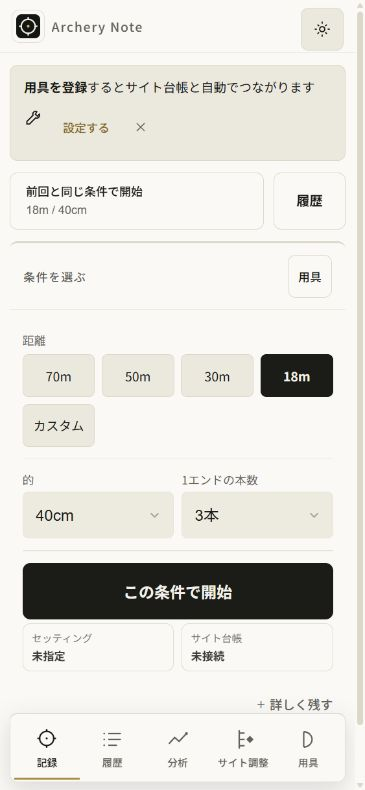

### Capture 2 — 02-guide-375.jpg

状態: 的と固定操作は見える。

所見・限界: expandedガイドは的の下。説明はfixed dockより下にあり初画面から読めない。

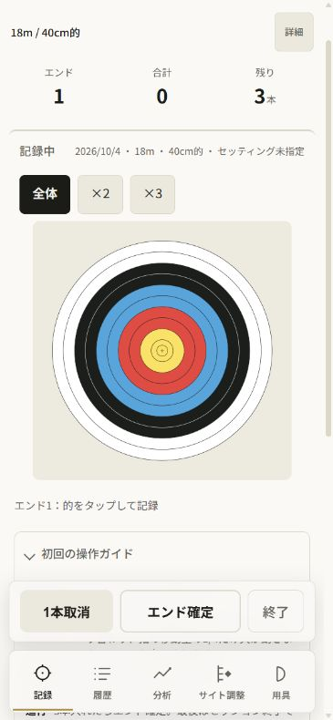

### Capture 3 — 03-guide-reading-375.jpg

状態: スクロールすれば記録・精密・微調整・進行を読める。

所見・限界: 終了の案内だけボタン名と違う。矢チップと微調整入口のつながりが文だけでは弱い。

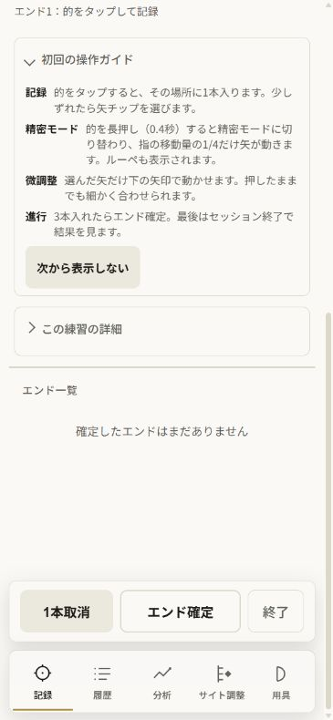

### Capture 4 — 04-guide-reading-320.jpg

状態: 320でも説明の本文は折返して読める。

所見・限界: viewport変更時のscroll保持で上部見出しは画面外。取消・確定は2行表示。全文と固定dockを同時には収められない。

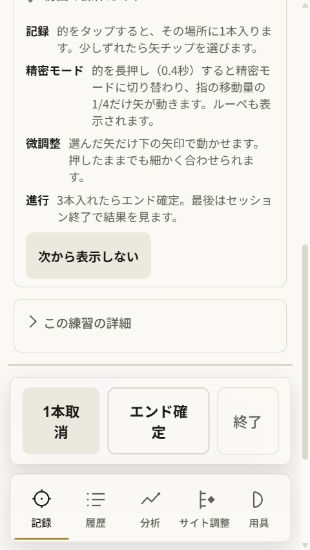

### Capture 5 — 05-record-empty-320.jpg

状態: HUDと固定操作は表示される。

所見・限界: Homeでscroll0に戻した検査状態では的の中心付近がdockに重なる。通常開始時の自動scrollとは区別が必要。

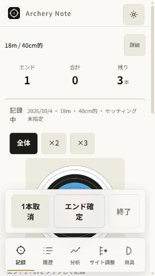

### Capture 6 — 06-before-arrow-375.jpg

状態: 375の的全体が固定dockより上で見える。

所見・限界: 説明本文は下にあるため、ガイドを読んだ後は的まで戻る必要がある。

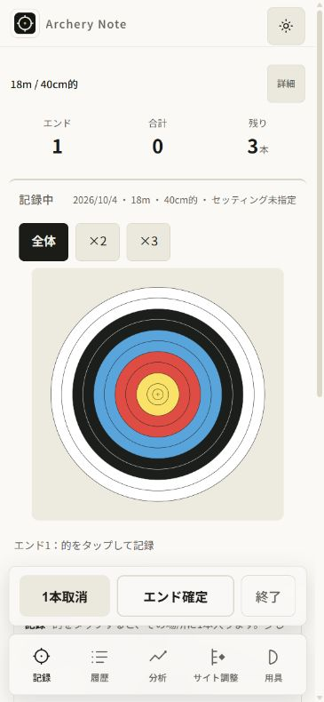

### Capture 7 — 07-first-arrow-375.jpg

状態: 得点10・残り2と矢チップが更新される。

所見・限界: チップ名は得点だけで、微調整入口だと初見で分かるかは実利用者の確認が必要。

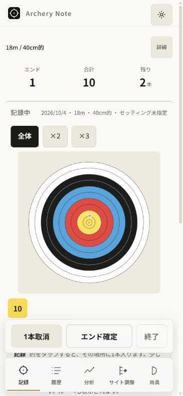

### Capture 8 — 08-correction-375.jpg

状態: 選択チップ・四方向パッド・1目盛0.2cmが見える。方向buttonに明確な操作名がある。

所見・限界: 選択解除はメタ情報の下で最初のviewport外。guide文は次の戻り操作を説明していない。

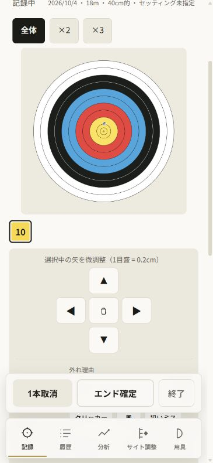

### Capture 9 — 09-adjusted-375.jpg

状態: 調整後も選択と10点表示を維持。

所見・限界: パッド操作後は的上部がviewport外。選択解除と全ての入力情報を同時に見せる画面ではない。座標/物理の独立検証は今回しない。

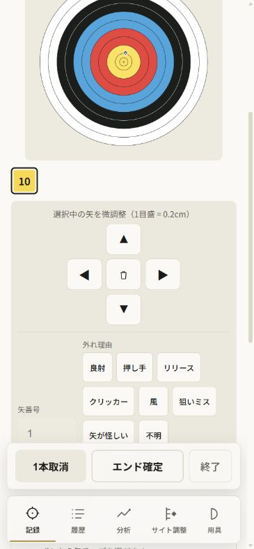

### Capture 10 — 10-back-to-target-375.jpg

状態: 選択解除でパッドが閉じ、的へ戻れる。

所見・限界: 解除locatorのauto-scrollを使った。画面外の解除を指で発見できるかはこの操作だけで保証しない。

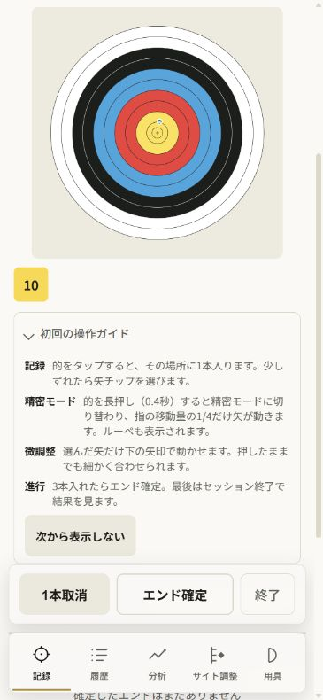

### Capture 11 — 11-end-ready-375.jpg

状態: 3本・合計30・残り0、確定ボタンは固定表示。

所見・限界: トーストはガイド下部に重なるが固定確定操作を覆ってはいない。

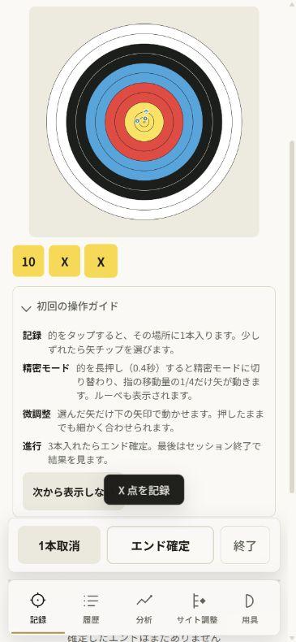

### Capture 12 — 12-end-confirmed-375.jpg

状態: 確定でエンド2/残り3へ進み、エンド1・30点の一覧とトーストが出る。

所見・限界: 終了までの文は依然セッション終了というUIに無い名前。終了は固定dockで押せる。

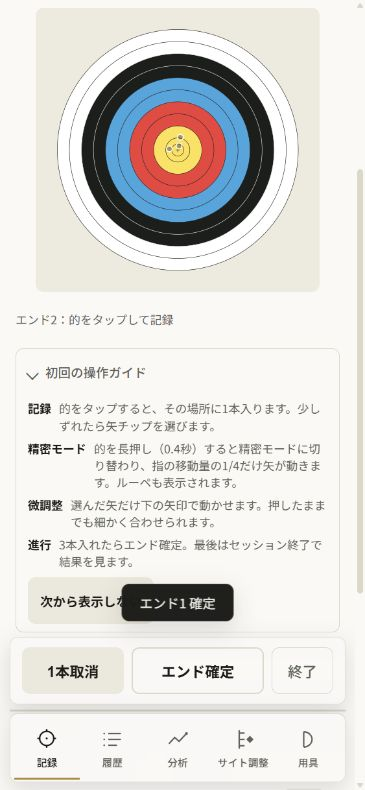

### Capture 13 — 13-finished-375.jpg

状態: 終了一回で3本30点の結果と前回/成長の比較に進む。

所見・限界: この監査で保存schema/物理/実機の正しさ全体は確認しない。既存所有架空履歴との比較。

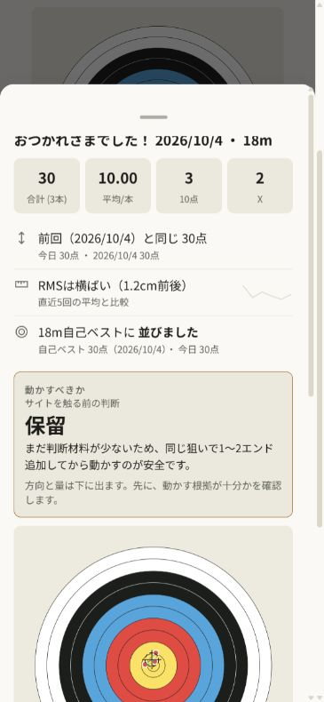

### Capture 14 — 14-entry-320.jpg

状態: 前回条件の開始は320でも初画面に見える。

所見・限界: 条件指定の開始は折返しと用具ヒントにより画面外。今回は同じ3本条件の開始buttonをlocatorでscrollして押す。

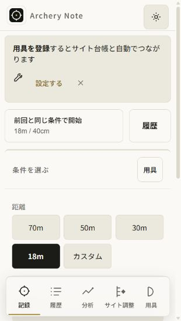

### Capture 15 — 15-started-320.jpg

状態: 記録開始と固定操作は表示される。

所見・限界: 通常の条件指定開始でscrollY416.67が残り、的SVG上端-91.33、中心約10.91px。的の上半分が画面外。Home検査とは別の実操作。最優先候補は開始直後に的を操作できる位置へ戻す。

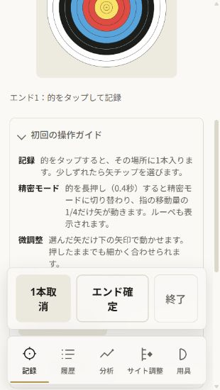

### Capture 16 — 16-target-reached-320.jpg

状態: 手動で上へスクロールすれば的全体を操作できる。

所見・限界: 開始後に必要な戻りscrollが一手増える。アプリの自動回復とは扱わない。

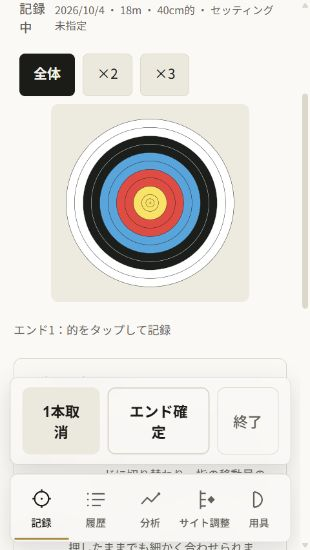

### Capture 17 — 17-first-arrow-320.jpg

状態: 1本/10点/残り2へ更新、chipは見える。

所見・限界: 手動scroll後の成功であり通常開始時の的露出を保証するものではない。

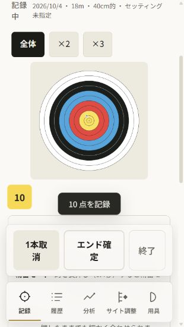

### Capture 18 — 18-correction-320.jpg

状態: 320でも四方向のパッドを固定dockの上で操作できる。

所見・限界: 的上部は画面外になる。メタ情報と選択解除はさらに下。実タッチ/読み上げ未検証。

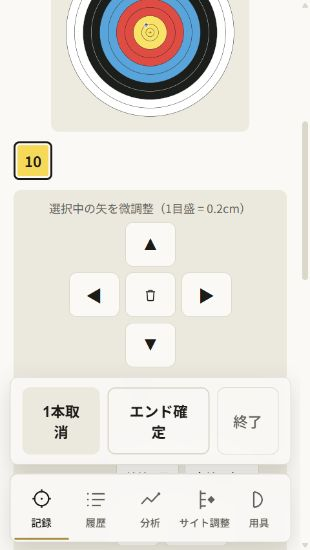

### Capture 19 — 19-adjusted-320.jpg

状態: 微調整後も選択と10点表示が残る。

所見・限界: このframeではパッド下端が固定dockに重なる。通常motion/scroll/focusの影響を分離していないため原因と修正は未確定。

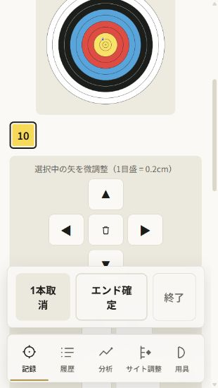

### Capture 20 — 20-partial-end-confirmed-320.jpg

状態: 3本設定でも1本の確定を受け付け、エンド2へ進む。

所見・限界: guideの3本入れたらという文はpartial確定が可能なことを説明しない。削除・resetは実行していない。

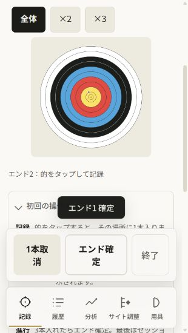

### Capture 21 — 21-finished-320.jpg

状態: 終了で1本10点の結果へ進む。

所見・限界: 1本でもRMS0.8→0.0cmを改善色で表示。1本のRMS0だけで成長は判断できないため、別の表示条件監査が必要。6本以上の助言は下部。

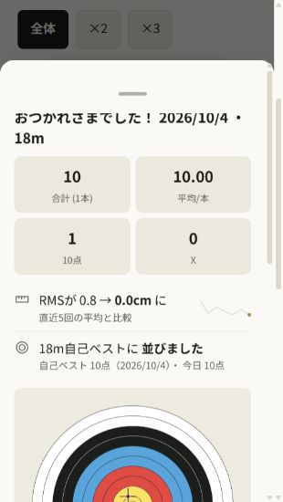

### Capture 22 — 22-history-reloaded-320.jpg

状態: reload後も履歴7回/28本と表示リスト全文が同一。

所見・限界: DOMの表示保持の確認でありDB全項目exactやoffline保存試験ではない。

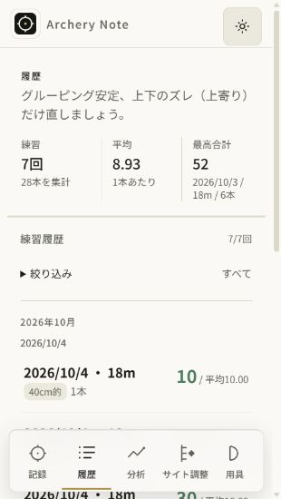
