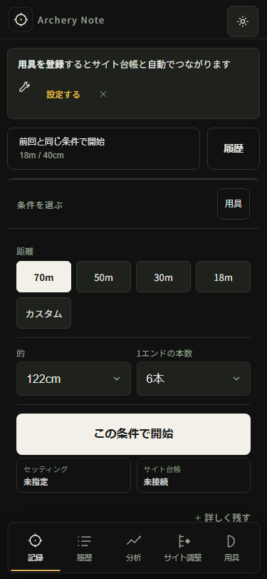
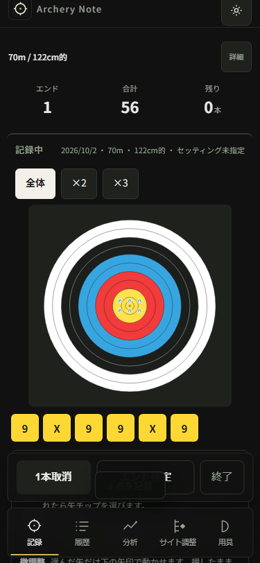
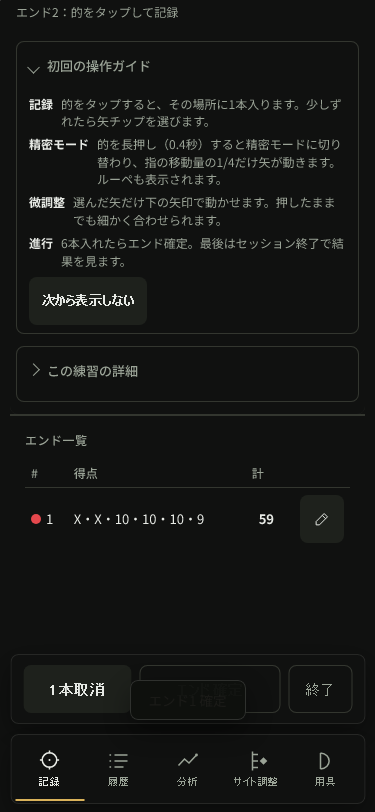

# Six-arrow phone flow — AN-048

The survey found three bounded UX issues: the target can remain offscreen after
returning from arrow correction; recording toasts overlap the end action's label;
and the start form's face/arrow-count selectors have no associated accessible label.
The offscreen-target issue also reproduces in the immutable publicv95 source, so
this is not evidence of a regression introduced by the pendingv96 optimization.

No application or release candidate was changed. The release branch stays at
`85a52fc5b6f2300fbf46436e0c10b5a1bcf5e8c3`. Human approval arrived after this
survey; publication is tracked separately in AN-047. This read-only survey has its own branch,
`codex/phone-end-flow-audit`. No fees, personal practice or user browser profile.

## Scope and steps

Fresh headless Chromium/WebKit,320×568light and375×812dark, mobile/hasTouch,
deviceScaleFactor1, normal motion. An owned loopback server serves immutable85a52fc
bytes. Service workers are blocked: this survey adds no update/offline claim.
Conditions are70m/122cm/6arrows, using the app's synthetic demo plus one new practice.

1. **Conditions — usable, label gap.** Select70m/122cm/6 arrows, then start. The
   resulting practice has exactly those conditions. Both fFace/fArrows have
   labels=[], no aria-label/labelledby, and unnamed comboboxes in the ARIA snapshot.
2. **Active practice — usable.** The target and fixed action row are available.
   The initial operation guide is open in this new-demo context; this result does
   not describe returning users with the guide suppressed.
3. **Six arrows and undo — usable, notification overlap.** Six screen-coordinate
   touchscreen taps create six arrows. Undo preserves the first five exactly, and
   a replacement returns the count to six. A shown,0.98-opacity score toast overlaps
   the end button in all four cases. It has pointer-events:none, so this is a visual
   label obstruction, not a proved inability to click the action.
4. **Correction — requires scrolling.** Select the first score chip and move the
   selected arrow right; persisted x increases. The right control is initially
   below/behind fixed controls on375px; selection cancellation needs scrolling
   on320px. These are secondary controls; they are observed friction, not a claim
   that every correction must work without scrolling.
5. **First end confirmed — next-target gap in WebKit375.** Confirmed first-end
   data equals the corrected current arrows and cur becomes empty. In WebKit375,
   after the correction/cancellation sequence, the new second end has zero arrows
   but the target is entirely offscreen: y=-309,height292.3125,visibleHeight0.
   The retained screenshot shows the second-end prompt/guide and first-end table,
   with no target. A simulated manual scroll back is needed to add the next arrows.
   This is after the **first end** is confirmed, not after confirming the second.
6. **Finish and reload — data preserved within scope.** After the recorded recovery,
   complete the second six-arrow end, finish, and close through the visible result
   handle. New record has ends[6,6], active=null; the original three sessions are
   deep-equal and all four saved sessions survive reload. Page errors0. Final
   reloaded layout has no horizontal overflow; overflow was not measured at every
   intermediate step.

Condition selection/start and result navigation include locator operations. Arrow,
undo/correction/end/finish input uses Playwright's headless touchscreen taps.
Scrolling is programmatically simulated manual movement, not a physical swipe or
native iPhone keyboard/gesture test. Whole-storage invariance, score-boundary
accuracy, actual iPhone/VoiceOver and community preference are not established.

## Current-run visual evidence

Conditions and six-arrow operation in375px Chromium:





WebKit375 immediately after the corrected first end is confirmed; the second-end
target is offscreen:



All six steps for each context have current-run images and ARIA snapshots under
`artifacts/phone-end-flow/complete`. The shown files were copied byte-for-byte
from that run and visually inspected. No old screenshot is used as survey evidence.

## Measurements, retained failures and control

| Engine/width | Toast/end overlap px² | Offscreen target recovery after correction | End sizes after save |
| ------------ | --------------------: | ------------------------------------------ | -------------------- |
| Chromium320  |           3165.421875 | Not observed                               | 6,6                  |
| Chromium375  |           3284.015625 | Not observed                               | 6,6                  |
| WebKit320    |             3157.6875 | Not observed                               | 6,6                  |
| WebKit375    |           3407.765625 | Required, visibleHeight0                   | 6,6                  |

```text
PASS: four six-arrow flow surveys with recorded manual-scroll recoveries
PASS: one baseline95 WebKit375 six-arrow flow survey with recorded recoveries
```

These results do not mean four scroll-free flows. The final helper explicitly logs
and recovers from offscreen secondary controls and the next-target case. The
immutable95 control uses97945e17dd1529a527be5f0750372378818b2a57, one WebKit375 case,
and reproduces the same labels, toast overlap and target y=-309,height292.3125.
Prior failed probes and data are not replaced with the successful survey label.

Initial `audit.cjs` failed trying to tap offscreen nudgeDone. The next helper's
scrollIntoViewIfNeeded left a correction button inside the viewport but behind
fixed controls. Explicit simulated manual reveal corrected that harness assumption.
`audit-final.cjs` then completed three contexts and stopped on the true WebKit375
next-target visibility failure. `audit-complete.cjs` records that finding before
manual recovery and completes all four. Visible-point coordinates are clamped to
the viewport; no automatic locator click hides that target failure. All processes
close context/browser/server in finally.

Raw files: output.txt/output-corrected.txt/output-final.txt/output-complete.txt,
complete/result.json and per-context snapshots/results/images,
final/webkit-375-failure.json, output-baseline95.txt and baseline95/result.json.
The final raw script is audit-complete.cjs; baseline script is audit-baseline95.cjs.

## Review and next work

Independent read-only evidence/source review confirmed the findings and scope,
especially first-end versus second-end wording, headless touch versus physical
gestures, scoped session retention and visual toast obstruction. No data-loss or
scoring claim is inferred. Prioritize AN-049: fix and lock down target visibility
after returning from correction. Keep toast placement (AN-050) and start-field
labels (AN-051) as separate small tasks. The source cause of scroll retention is
not yet established; first build a failing regression at the actual return path.

## Final record validation

```text
PASS: audit4 and baseline1 scopes/data retained; prior tasks unchanged; release85 frozen; source unchanged; three images byte-identical
PASS: 101 candidate source/test/dependency files match owned sandbox; shared hidden lock unchanged
All matched files use Prettier code style!
```

The candidate's full116-test result remains valid for unchanged source. Publication
preflight runs separately. An attempted source-helper invocation from the sandbox
used the wrong relative path and returned MODULE_NOT_FOUND; the correct root
invocation passes as above. This is a helper-path error, not an application failure.
