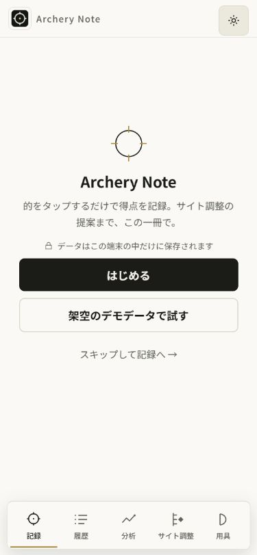
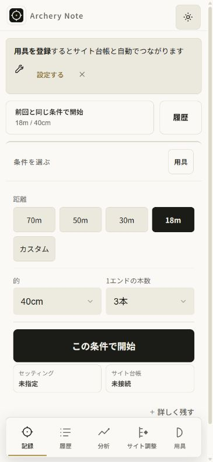
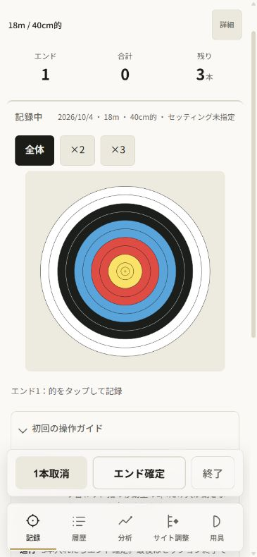
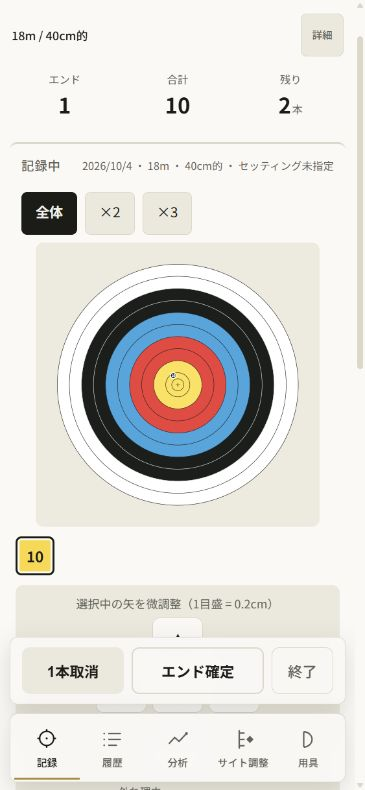
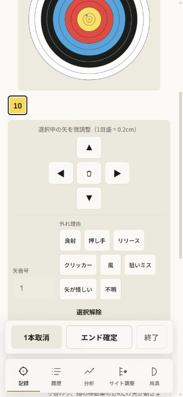
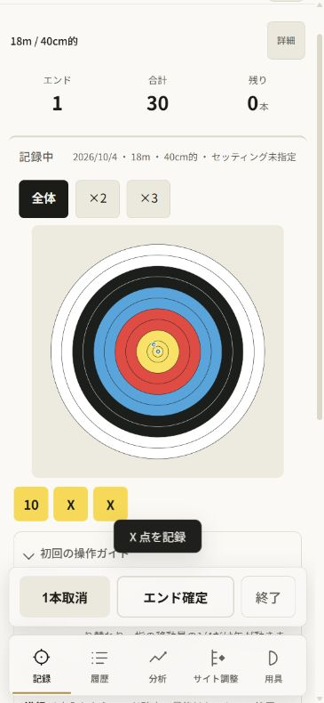
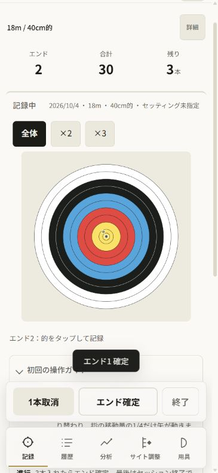
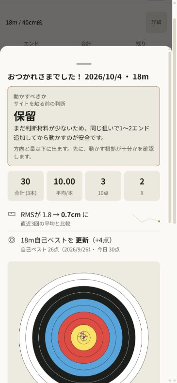
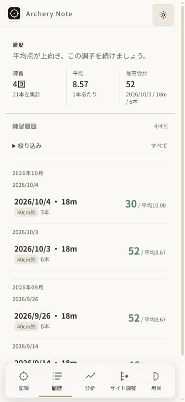
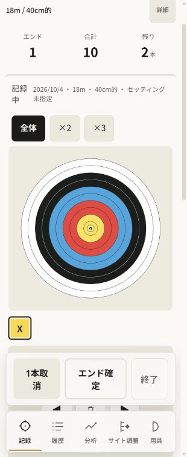

# 公開v102 — 記録から履歴までのUX監査

2026-10-04。前回AN060は公開修正完了でprogress。今回は一小タスクAN061として実公開の操作を監査した。公開main `d668965470070262c239e58752ed461fbd5e6d44`、version.jsonは102。所有の新しいin-app browserタブを開始画面から操作し、架空デモだけを使用した。料金・個人情報は使っていない。アプリの実装・公開版は変更していない。

目的は、練習中の記録→修正→確定→終了→履歴を迷わず行えること。375×812のlightで全経路を撮り、320×780では矢の選択だけ追加確認した。全10枚を同じrunで保存し、各画像を実際に表示・確認した。ファイルコピーのbyte/hash一致は artifacts/ux-flow-v102/evidence.json。古いスクリーンショットは監査の根拠に使っていない。

サイズはIABのviewport設定値。JPEGの実寸は入口375×811、手順2〜9は365×790、320設定の手順10は310×756だった。画像の寸法を実機寸法と同一とは扱わない。手順10のDOM実測innerWidthは320、innerHeightは780で、重なりの数値は画像ピクセルではなくCSS座標。撮影ファイルの時刻は2026-10-03T23:37:54.732Z〜23:41:43.440Z（JSTでは10月4日）、各画像の実寸/時刻/SHAをevidence.jsonに残した。

## 優先する改善

得点チップを選んだ直後、微調整の矢印が固定操作列に隠れる（手順4・10）。開始/確定の入口は見えるのに修正だけスクロールを追加するため、記録のリズムを崩す。次の一小タスクAN062では、矢を選んだ時だけ微調整の操作パッドをドックより上へ出す。タグ入力や連続微調整のたびにスクロールさせず、閉じるときの既存の的への復帰を保つ。

案は3つ確認した。操作パッドを的の上へ常設すると通常の記録を狭くする。外れ理由を折りたたむだけではパッドの上端がドックより下にある問題を解決しない。選択時に操作パッドを表示位置へ出す案を推奨する。選択による視点移動は発生するが、必要な操作がすぐ押せる。全画面の改修や得点・保存の変更は不要。self-reviewで条件と対象を絞った。

4gateは、記録修正が分析・履歴の入力に繋がり、成長データの誤入力を減らし、処理はlocal、毎日の操作を増やさない、を確認した。既存の全承認の範囲で次を進める。

## 今回観察した手順

### 1. 初回の入口 — 良好



端末内保存とデモの入口が見える。個人情報やログインを必要とせず始められた。画像だけで読み上げ順やコントラスト基準を満たすとは言えない。

### 2. 条件の選択 — 良好



前回条件と今回条件の開始を区別できる。的と本数はAXでも名前が付いている。用具登録の案内は上部の面積を使うが、今回は改修対象にしない。

### 3. 的への入力 — 良好



的と固定した確定操作列が見える。初回ガイドは開いている。ガイドの「セッション終了」と実ボタン「終了」は表記が違う。理解への影響は利用者確認が必要。

### 4. 得点チップで矢を選択 — 要改善



チップ選択後、微調整の矢印が固定操作列の下に隠れる。操作が開いたことは説明で分かるが、指で押せる矢印が見えず追加スクロールが必要。今回の優先課題。

### 5. 矢印で微調整 — 要改善



▼を操作するため、ブラウザがスクロールした後は微調整ボタンを押せる。的の上部は画面外に出る。AXでは方向が記号だけ、中央の削除ボタンは名前なし。VoiceOver実機では未確認。

### 6. 3本記録して確定待ち — 良好



10・X・Xと残り0本を確認でき、エンド確定ボタンは追加スクロールなしで見える。記録通知は操作列に重ならない。この375px条件での観察。

### 7. エンド確定 — 良好



合計30のままエンド2・残り3本へ移り、確定の通知が見える。次の記録を待つ的と操作列が残る。実射や保存耐久性をこの監査だけで証明してはいない。

### 8. 練習終了と結果 — 操作可



終了で結果のシートへ進む。得点・本数・平均が見えるが、上部はサイト判断の説明が先に来る。見せ方の優先順位は別の検討候補。今回の改修対象に含めない。

### 9. 保存した練習の履歴 — 良好



結果を上の閉じるボタンで閉じ、履歴に18m/40cm/3本/合計30/平均10.00が増えた。デモ3件と合わせ4件21本。履歴の一般的な長期性能は未計測。

### 10. 320pxで矢を選択 — 要改善



375pxと同じ微調整の隠れ方を再現。ドック上端601.33pxに対し▲の上端623.45px、◀/削除/▶675.45px、▼727.45px。矢印はドックや下部タブと重なる。320pxで全終了経路をやり直したとは言わない。

## 根拠と限界

sourceではrefreshActiveがチップをドック上へ出した後にnudgeを表示し、選択開始時に操作パッドを出す処理がない。解除後に的を出すrevealActiveTargetは既にある。今回のUI観察と整合する。先の139成功の広いテストを、この隠れ方が解決している証拠には使わない。

これはIABのpointer clickと画面・AXによる監査。native phone touch、実iPhone、VoiceOver、dark、offline、5000件、実INPは今回の範囲外。完全なアクセシビリティ適合や速度改善を主張しない。方向の記号と名前なし削除ボタンは手順5で観察したアクセス上のリスクとして残す。終了結果の優先順位、初回ガイド表記の差は今回直さない。

タブは閉じ、viewport overrideをresetした。スキル参照の旧docs/ui-design-language.mdは見つからず、rgで正本docs/design/ui-design-language.mdを見つけて読んだ。検索globのWindows指定誤りと存在しない旧記録docの参照も、現在sourceの確認へ切り替えた。アプリvalidationの失敗ではない。notes-only変更なので新しい全E2E/公開CIは不要、書式とtask/source不変の確認を行う。

実出力（所有sandboxでformat:check実行、format.txt/records.txt）:

```text
PASS:10 accepted JPEGs copied byte-identically;62 tasks/all60 prior tasks unchanged; audit/source-grounded next action recorded; no app change
All matched files use Prettier code style!
```
