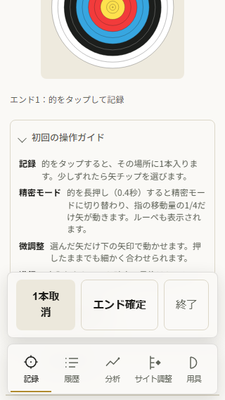
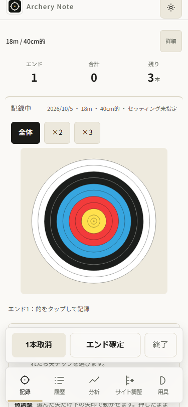
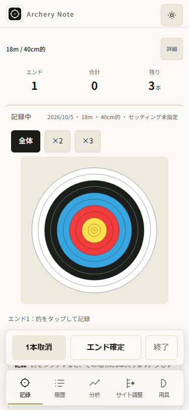
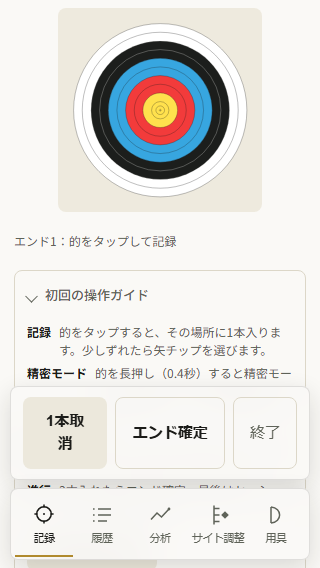
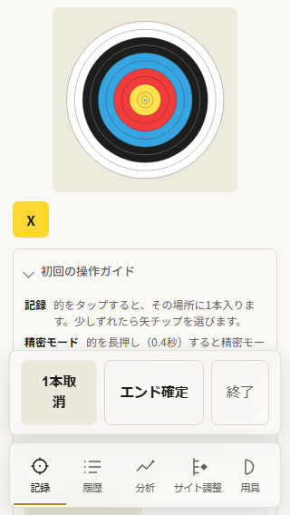

# 記録開始直後の的の表示位置

AN068。AN067で通常の320px条件指定開始後、的の上端が-91.33pxに残る問題を観測した。開始前後の位置をnative touchで採取し、原因を確認してから修正する。

- 条件指定・前回条件・初回セットアップを320/375、通常/抑制モーションで検証。開始ボタンだけを事前に表示し、開始後の復帰スクロールやlocator自動スクロールで問題を隠さない。
- 的全体がheaderと固定dockの間に収まり、最初のnative中心tapで矢が増えること、旧履歴とreload後のactive保持を確認する。既存の解除/確定・通常更新・タブ復帰の検証も実行する。
- 原因が開始境界の位置保持なら既存revealActiveTargetを新規開始にだけ適用する。採点・保存・通常renderを変えない。
- 375px前後画像、red/green、必須チェック、読取専用review、承認済み公開更新の証拠を残す。

記録→履歴→集計→サイト判断へつなぐ入口を直し、見える的への入力から成長の材料を作る。端末内保存を保ち、日々の記録開始の手戻りを一つ減らす。四つのproduct gatesに合う小さな修正である。

## 原因と修正

native開始clickのcapture/bubble観測で、320条件指定の開始前後ともscrollY417。通常motionで的上端はhandler直後-84、静止後-92px（高さ204.47）、dock上端386。抑制motionでも同じ最終位置で失敗する。位置を引き継ぐrenderと、新規開始境界で的を表示しないことが原因。

既存revealActiveTargetをfStart/onboarding-startのrender後に追加。前回条件はfStartを使う。最初の修正だけでは通常motionの的上端が8→0へ移動し、一件失敗。style.cssのmain.viewEnter .cardに8pxのitemRevealが適用されるため、新規開始のrender直前にviewEnterを外してから位置を測る。最終320は同じcapture417→bubble317、的上端8/下端212.47、dock386。位置はanimation後も同じ。通常render・再開・タブ復帰・保存・採点・次距離処理を変更しない。

## 検証経過

- 初回12件は4 failed / 8 passed。一件目/四件目が位置失敗、onboardingの2件はまだ保存されていないblank stateをテストが読んだnullエラー。fixture読取を空履歴として修正し、失敗出力/画像はinitial-redへ保持。
- 修正前の正しいredは2 failed / 10 passed (33.2s)。320条件指定の通常/抑制が-92pxで失敗。他の入口・375は元から成功する対照。
- helperだけ追加した中間runは1 failed / 19 passed (1.5m)。既存解除/確定/位置保持4件と条件表示4件は成功、通常motionの8pxが最終0となるケースだけ失敗。intermediate-resultsとgreen.txtに保持。
- 新規開始のmotionを外した最終runは12 passed (33.4s)。各ケースで回復scrollなし・native中心tap一回・旧履歴一致・reload後active全field一致・pageerror空。
- 全出力・各ケースのgeometry/trace/実画像はartifacts/record-start-v106。リリース検証はこの後追記する。

## 保存・表示して確認した前後画像

同じ320/375・通常motion・条件指定の実テスト画像。fix前/後のownedプレビューであり、版bump前に採取した。375は両方とも的が全体表示される対照。画面の字形・date描画を比較する検証ではない。コピー後に原寸で4枚表示・目視した。








実iPhone/VoiceOver/実INP、旧公開更新profile失敗、ガイドcopy/320微調整下端/RMS少数矢の表示信頼性はこの修正の証拠範囲に含めない。

## 公開版と受入結果

source `74f1a22d641d91a76ca3c22eb955f12df581637b`、公開v106。CI [37220268127](https://github.com/eita115115/archery-note/actions/runs/37220268127) validate/deploy成功、実Linux artifact11309998454。公開/実Linux25資産は全byte exact一致。採点・schema・依存graph・SW activationは不変で、SW変更はcache版のみ。共有hiddenlockも保持。read-only reviewはP1/P2なし。

保存した実コマンド出力の抜粋（全出力はartifacts/record-start-v106）:

```text
npm run check:all
Archery Note checks OK (v106)
UI smoke checks OK (chrome.exe)
PWA asset checks OK
PWA update flow checks OK
Storage contract checks OK
Storage round-trip checks OK
Save debounce checks OK
Version alignment checks OK
Distribution checks passed:14 structures/names/order/source/regeneration; gzip JS 196667→139341 bytes; cross-script fixtures

npm run lint
> eslint "*.js" "scripts/**/*.js" "tools/**/*.js" "tests/**/*.js" "eslint.config.mjs"
(exit 0)

npm run format:check
All matched files use Prettier code style!

npm run test:e2e:dist
170 passed (2.1m)

Generated WebKit / new-start matrix
12 passed (32.6s)

Actual Linux CI
170 passed (3.4m)

PASS:all25 actual Linux/public106 assets byte-identical; all15 held-update first-document warm bodies match Linux
```

### 実保持した公開105→106の検証

公開105で架空デモ3件＋native1矢を作り、15資産を通常HTTP cache600秒でwarm。記録中は更新を止める既存仕様を確認してnative終了→4履歴。その後に更新bannerを押した。warm後325784msのclickはCDN Ageを差し引いた残存freshness597000ms以内。

新documentのdeferred scriptより前に検証側の`waitForFunction(()=>APP_VER===106)`が実行され、ReferenceErrorが一件出た。失敗stackは検証側predicateを指す。failure.json / failure-state.json / 元process出力を保持し、エラーなしのrunへ置き換えていない。所有Node processのdebuggerから**既存Playwright Pageと元response/error listenerの参照**を回収した。同じappv URL・fixture IDs・contextで、再作成やresetなしに106/cache106only/旧4履歴全field・元first-document15body・canonical14scriptを実Linuxと照合。

同じcontextを320へ変更し、条件指定開始後に全的表示をassert・画像保存してから中心へnative tap一回。保存直後の同期読取で0と判断する検証側のassertも失敗したが、再tapしていない。後のreadでmemory1/stored1を確認し、debounceを待つ検証へ進めた。オフラインSWreload後の旧4＋active1は全field一致、追加pageerrorなし。元の一件はerrorsに残す。`complete.json` / recover-read・scope-recovery・recover-complete・recover-arrow-read・recover-finish / parity.json / freshness.jsonに回復経路を残した。元公開processは回復後にcontext/browserを閉じ、元失敗exit1は保持。

公開前のlocal harnessでは、記録中にbannerを待つ誤った一試行と、存在しないsummaryPlotを待つ一試行があった。後者の実保存active nullと終了シート画像は保持・表示。local-harness-abort.jsonに対象process/理由を記し、明示abortしてアプリ不具合の回復とは扱わない。正しいsumPlot/sumCloseと記録終了後更新のlocal予行は成功した。freshness計算の単発shell regexエスケープミスはfixture scriptへ移して再検証した。

以下の公開画像2枚も保存bytesを原寸で表示・目視し、byte同一copy。最初はnative入力前、二枚目は唯一の矢入力後のオフライン再読込。





次の一件は初回ガイドの案内と実際のラベル/操作（終了、選択解除、途中エンド確定）を揃える候補。ガイドcopy以外の微調整下端/少数矢RMS表示は別に原因確認して扱う。大目標はactiveのまま。
