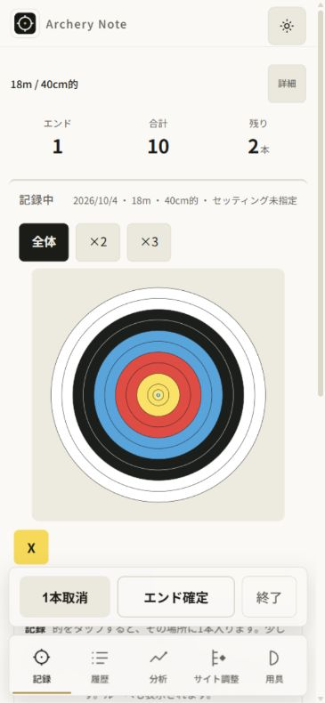
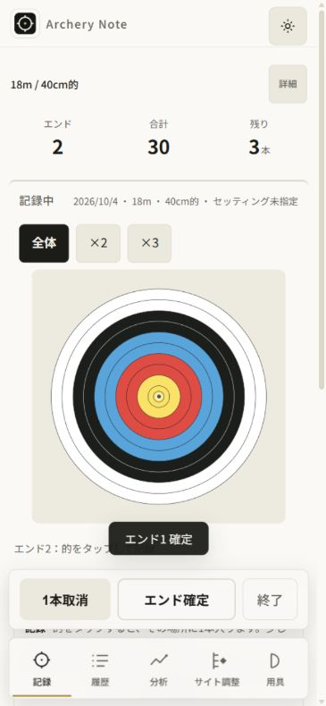
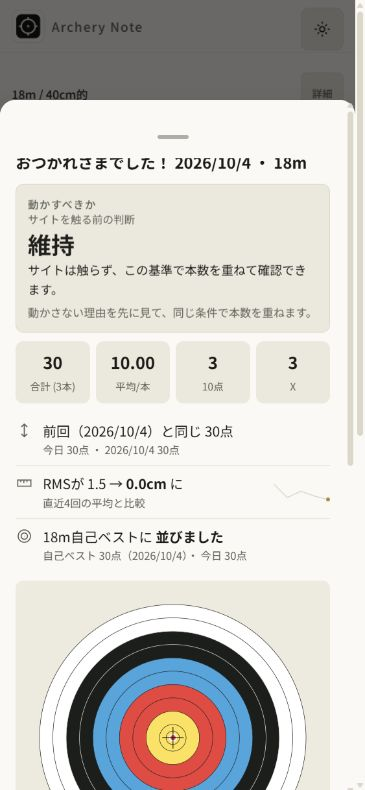
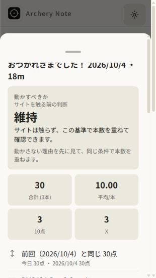
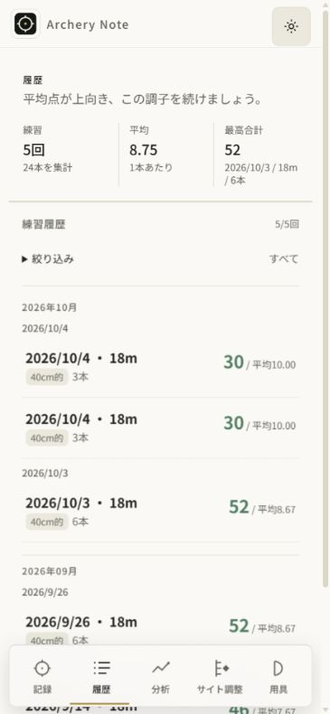
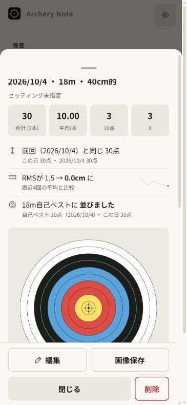

# AN-064 — 練習終了結果の情報順序を監査

前run AN063は公開104で微調整の操作名を修正し、実公開受入を揃えたprogress。
今回は一件のUX監査。実装・版変更・公開は行わず、次の一小タスクを実画面から選ぶ。
既存の全承認で所有IABを操作した。費用・個人情報は使っていない。

## 対象と方法

実公開 https://eita115115.github.io/archery-note/ を所有IABの新規タブで開いた。
読み込んだ14scriptのDOM srcはすべてv=104。公開sourceは前受入の88b33445。
この監査ではbody/hashの再照合まではしていない。
このブラウザに前の所有監査の架空データと18m/40cm/3本条件の未完1本が残っていた。
それを継続し2本追加、3本/30点のエンドを確定して終了した。
データをリセット・削除せず、履歴は5件24本になった。ユーザー実記録は使っていない。

375×812、終了シートのみ320×568で確認。6枚すべて同じrunで保存・開いて受入れた。
IABのJPEGの実ピクセル数は375時365×790、320時310×550。
DOM測定はlogical CSS px、画像はIABの縮尺を含む。実物のスマートフォンではない。
capture-list.json/evidence.jsonにfile/bytes/SHAを残し、tracked画像へ同一bytesをコピーする。

目的は、終了後に「何点・何本・前回からどう変わったか」をすぐ読み取れること。
sourceのopenSummaryと履歴のhistDetailSheetを比較し、既存のデザイン言語を維持する。
product-design audit/user-context preflightは保存contextなし。今回の公開URLとsourceを使った。
BrowserのAPI説明を読みIABを明示選択。正本はdocs/design/ui-design-language.md。

## 画面ごとの観察

### 1. 終了前の記録 — 良好



18m/40cm、合計10、残り2本、的と固定ドックが読める。
本数を揃える入口と終了操作は分かりやすい。初回ガイドの文言や数値計算の監査は対象外。

### 2. エンド確定 — 良好



3本/30点を確定するとエンド2・残り3本に移り、確定の通知が見える。
このUI操作でエンドは完了し、終了ボタンから結果へ進めた。実射や保存耐久性は証明しない。

### 3. 終了直後375px — 情報順序に改善余地



おつかれさまの見出しの直後に、サイトを「動かすべきか」の判断カードが来る。
今回の結果では「維持」と説明が最も先に目に入り、その後に30点/3本/平均10.00、
前回比較・RMS・自己ベストが並ぶ。結果そのものは揃っているが、主役の優先順位が分散する。
AXでも判断のテキストが数値より先。読み上げの情報順序も同じ構造になっている。

取得時のCSS位置: decisionCard182.78–335.07、statbar345.07–409.07、
summaryTodaysResult419.07–581.47。モーションの全フレームを検証した値ではない。

### 4. 終了直後320px — 比較の一部が画面外



判断カードの説明が折り返され、数値は2列になる。前回比較の最初の行は下端近くで、
RMS・自己ベストは追加scrollを要する。横overflowや壊れたカードはこの画像では見られない。
sheet scrollTop0、decisionCard176.83–345.79、statbar355.79–489.79、
comparison499.79–662.19に対しlogical viewport568px。

### 5. 保存後の履歴 — 良好



上の閉じるボタンで結果を閉じ、履歴へ移動できた。最新の18m/40cm/3本/30点/平均10.00が
並び、5回24本の表示が残る。架空の同点記録が二つあるが、今回保存した最新行を開いた。
並び順や長期性能を全件で検証したわけではない。

### 6. 同じ練習の履歴詳細 — 結果を読みやすい



こちらは見出し・条件の後に、30点/3本/平均10.00と前回比較が先に来る。
statbar208.29–272.29、comparison282.29–444.69。終了直後の画面より数値が約137px早い。
サイト調整の情報もその先に残り、再確認する流れが自然。
「今日」から「この日」の表記に変わっていることも読めた。過去全期間の算出妥当性は対象外。

## 次の一小タスク — AN-065

openSummaryを既存の履歴詳細と同じ優先順位へ寄せる。
見出しの次にstatbar、既存の今日の結果/比較を置き、その後にsummaryDecisionHtmlを残す。
サイト判断・理由・注意を削除/折りたたみで隠さず、計算・内容・保存・plot・閉じる操作は保つ。
新しいカード、色、アニメーションは要らない。

数値だけを先へ移す案では前回比較が判断より後に残る。
判断をdetailsへしまう案は提案の注意も見つけにくくするので、今回は既存要素の順序調整を選ぶ。
gamification/roundGroup/編集モード/比較なしの分岐は消さず、次の回帰で確認する。

4gate: 記録→結果→履歴比較をつなぎ、成長を読みやすくし、完全local処理を保ち、
毎日の終了後の読み取りを短くする。今回の監査を速度改善や新UIの受入と扱わない。

## 根拠と限界

openSummaryは現在h3→summaryDecisionHtml→statbar→todaysResultHtmlの順に生成する。
histDetailSheetはh3/subNote→statbar→todaysResultHtmlで、実画面/AXと整合する。
この順序の差が今回の改善根拠。149テスト成功を、このUXが解決している証拠には使わない。

pointer click/AX/保存JPEGによる監査。native phone touch、dark、VoiceOver、keyboard/Tab、
contrast、offline、実INP、5000件、計算/射形/physics/サイト提案の妥当性は今回未検証。
全アクセシビリティ適合とは言わない。名前付き上部closeで閉じられたがswipe/ESCは試していない。
タブは閉じviewport overrideをresetした。記録は所有架空データのまま残した。
今回はdocs/images/tasks/progress/ledgerだけなので、書式とsource/task不変を検証する。

実出力（所有sandboxでformat:check、records.txt/format.txt）:

```text
PASS:6 accepted same-run screenshots byte-identical;65 tasks/all63 prior tasks and acceptances unchanged; audit/source-grounded next action recorded; app/25 assets/dependencies/shared hidden lock unchanged
All matched files use Prettier code style!
```
