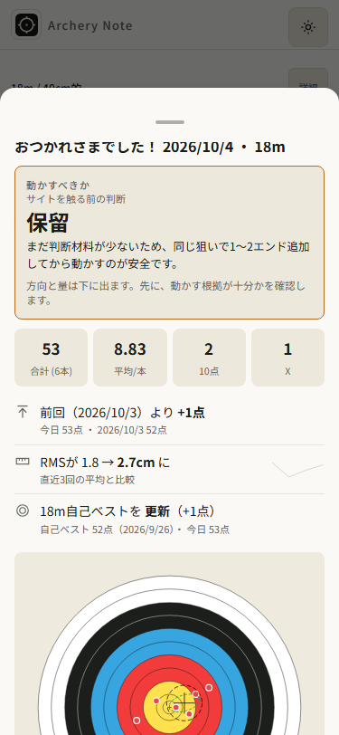
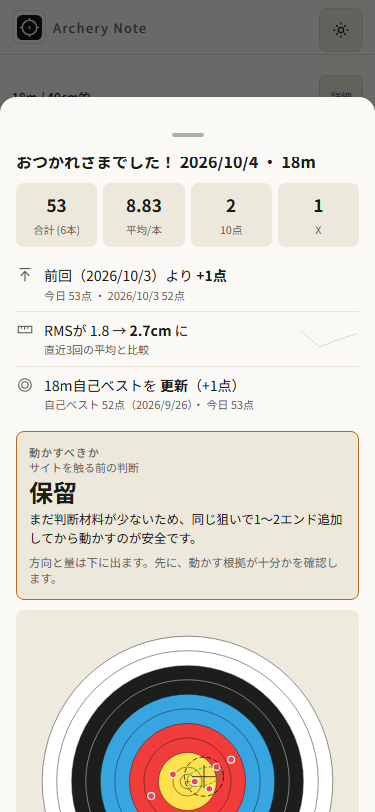
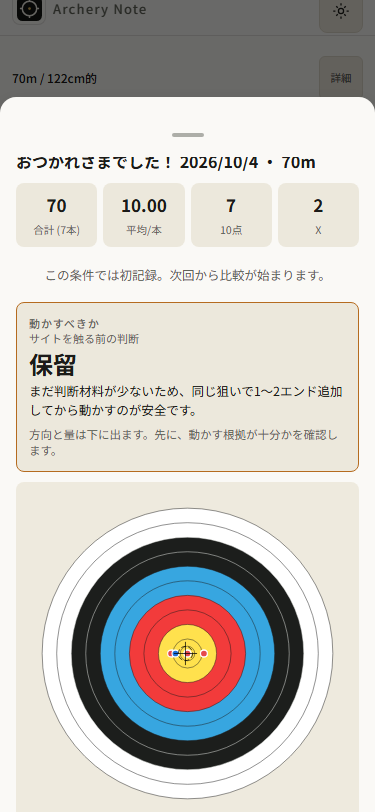
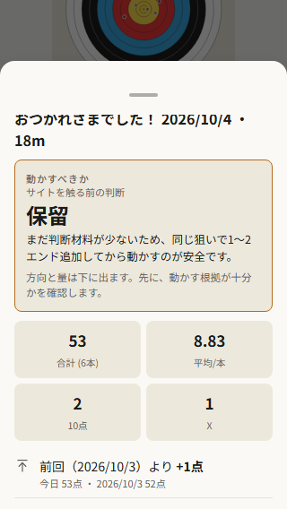
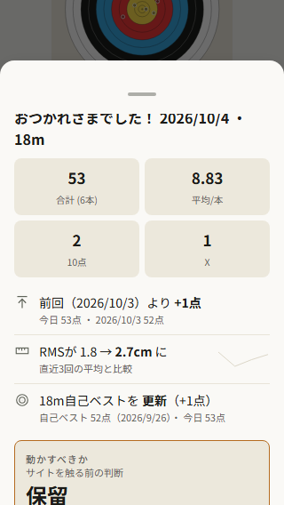

# AN-065 — 終了結果を先に読む

前run AN064は実公開104で情報順序を監査したprogress。今回の一小タスクは
openSummaryのサイト判断を、既存数値/比較より後、plotより前へ移すこと。
既存全承認で実装・公開まで進める。費用・個人情報は使わない。

## 設計と受入

見出し→statbar→既存todaysResult/gamification/roundGroup→サイト判断→plotの順。
全関数/条件/内容/注意/計算/保存/close/画像保存を保ち、呼ぶ位置だけを変更する。
新しい色・カード・CSS・motion・storage・依存・SW activationは追加しない。
数値だけ先にする案と判断をdetailsへしまう案はAN064で比較済み。
履歴詳細と同じ数値/比較優先を採用し、判断は通常スクロールで読めるまま残す。

4gate: 記録→結果→履歴の繋がりと成長比較を読みやすくし、local処理を保ち、
毎日の結果確認を短くする。自己レビューで分岐/注意保持/小画面を確認した。
既存全承認は実装と公開を含むので再承認は求めない。

1. tests/e2e/summary-order.spec.jsを追加。320/375・light/darkで実終了を押し、
   数値/比較が判断より先、数値が初期viewport内で読めることをred→greenで示す。
   first/比較なし、gamification、roundGroup、編集分岐の保持も確認する。
   架空fixtureだけで保存/履歴/plot/閉じるを確認し375前後画像を保存する。
2. scripts/50-record-view.jsのsummaryDecisionHtmlの出力位置だけを移す。
3. owned compact-js sandbox/isolatedNode22.19でcheck:all/lint/format/生成E2E。
   Chrome/WebKit320/375記録/修正/確定/次矢/設定swipe/offline/結果順序を確認。
   root/original node_modules junctionのinstall/ci/updateは禁止。read-only review。
4. markersを揃えた次版をcandidate/driver準備後に承認済み通常pushする。
   実公開104をnormalcache600で保持しrealbanner初回15body/14cache/practice exactを
   保存。実操作/offline、正確source LinuxCI/25publicbytesを照合する。
5. 実受入後のみAN065/progress/ledgerを更新。全65task acceptanceを保つ。

UI/release受入はevals/acceptance.md。実iPhone/VoiceOver/INP/全motionフレームや
サイト/physicsの計算妥当性の新しい証明は対象外。旧WK/profile失敗を保持する。

## 実受入 — 公開v105 / 2026-10-04

source 052d1358cf1a8cb3e8ff2e469353d585aa76fbbf; CI37189600851 validate/deploy success, actual Linux artifact11297768814, all25 public assets and actual held first-document15/canonical14 match. Owned check:all/lint/format success, ordering red7 failed then green7 passed (8.0s); final generated 156 passed (2.0m), Linux 156 passed (3.2m). 320/375 light/dark order/stat visibility, first/gam-round/edit branches, plot/close/store/reload retained. Native Chrome/WebKit320/375 correction/end/next/offline checkpoint3histories/end6/cur1 then native finish7 arrows, results before decision, close/swipe, SWreload4histories/active null, other records exact/errors0. Actual held public104→105 normalcache600 banner in 301607ms, firstAPP105/cache105only/practice5 exact, recording/settings swipe/offline checkpoint5histories/end6/cur1, then native7-arrow finish/result/summary swipe/SWreload6histories/active null/old5 exact/errors0; fresh public375 same success. Held/fresh probes explicitly use native Escape before native navigation; held starts focused anDist in analysis, fresh starts record with no focused control; four original local rehearsal touch/no-click failures retained and explicitly aborted after snapshot/liveness review, NOT recovered. Fresh minimal4 select/focus controls all click; complex-path suppression cause unresolved, no source fix claimed. Template call position only; conditions/calculations/scoring/storage schema/dependency graph/SW activation unchanged. docs/codex/summary-order.md; artifacts/release-v105. WK multitouch synthetic/origin-stop offline; physical iPhone/VoiceOver/INP/all motion frames unverified.

[公開CI37189600851](https://github.com/eita115115/archery-note/actions/runs/37189600851)。所有sandboxのnpm scripts実出力とLinux終端を保存。

```text
Archery Note checks OK (v105)
check-globals OK (14 files, 1240 unresolved refs all accounted for)
Analysis core characterization checks OK
Robust median reuse checks OK
Form core checks OK
Form metric fixture checks OK
Form diagnostic checks OK
Gamification pure-function checks OK (streak / 12 badges / backfill / goals)
Todays-result pure-function checks OK (weeklyDiff / stabilityTrend / personalBest / growthStreaks)
Security regression: all 38 checks passed
UI smoke checks OK (chrome.exe)
PWA asset checks OK
PWA update flow checks OK
Storage contract checks OK
Storage round-trip checks OK
Save debounce checks OK
Version alignment checks OK
Distribution checks passed:14 structures/names/order/source/regeneration; gzip JS 196657→139327 bytes; cross-script fixtures
156 passed (2.0m)
156 passed (3.2m) (Linux CI)
All matched files use Prettier code style!
lint: exit 0 (lint.txt)
PASS:all25 public105 assets byte-identical to actual Linux artifact; saved actual held104→105 first-document15 and canonical14 hashes match Linux
```

旧source104の7ケースはstats index3がdecision index2より後で7 failed、terminal1 (regression-red.txt)。同じ架空fixture/viewportで一行移動後7 passed (8.0s)。最終105生成物の156にも含めた。375明暗と320明暗の前後8画像と実public375を保存・目視した。











UI差分はsummaryDecisionHtml(adv,sess)一行の位置のみ。見出し後に既存statbar/結果比較/gamification/roundGroupを読み、その後で判断・注意を読める。計算・各条件・plot・保存・画像保存handler・closeは同じ。新たな画像保存動作の証明ではない。

Chrome/WebKit320/375 mobile-matrixのsessions3/end6/active1はoffline checkpoint。その後のsummaryOrderProofは同じcontextでnative終了し7本を保存、旧3件exact/新4件/active nullをSWreloadで確認した。Chromeはnative CDP swipe、WKはnative handle tap。実held/freshのcheckpointは旧5件/新規進行中7本、終了後は6件/active null。途中の数と終了後の数を混同しない。実更新の初回practice5exactはさらに前のimmediate-update.json。

read-only reviewでP1/P2なし。rehearsal/、rehearsal-diagnostic/、rehearsal-press/、rehearsal-native-nav/の4失敗を消さず保持。最初の3経路では終了シートが開かず、traceを追加した2回はhandler有効/正しいbuttonへのpointer/touchがありclickなし。4つめはnative record tab遷移自体が成立せず、練習データは変わらなかった。snapshot/現在liveness確認後に所有abort markerで明示終了した。成功への言い換えや元context回復扱いはしない。

rehearsal-select-escape/はpublic:false、実受入に数えない。native Escapeの後にnative nav/終了する経路は成功し、実held/freshでもEscape使用を明記した。実heldの直前はanalysis/anDist focus、freshはoffline reload後のrecord/無focusであり、freshではselect終了が必要だったという証拠ではない。最小のfresh4条件navigation-only/selectOption/focus+selectOption/focus+selectOption+Escapeはいずれもnative click成功(select-touch-diagnosis.json)。単独select focus原因説は未確定。複合経路のclick欠落は未解決で、アプリの修正は行っていない。tapTrace/入力条件は実held/fresh JSONに保存。公開の受入はその明記した操作経路に限る。

初回driver stagingはPython既定cp932でUTF8 clone読込が失敗し明示UTF8で修正(staging-failure.txt)。最小診断初回はdemoにない70m選択でsetup失敗、実option18へ修正しraw(select-touch-setup-failure.txt)保持。どちらもapp sourceを変えていない。

旧98→99/99→100profile失敗、WK setOffline/lifecycle失敗、実iPhone/keyboard viewport/VoiceOver/Tab順序/INP/5000件/全motion/GPU/実射未確認もprogressに保持。性能向上の計測や新しいphysics証明ではない。
