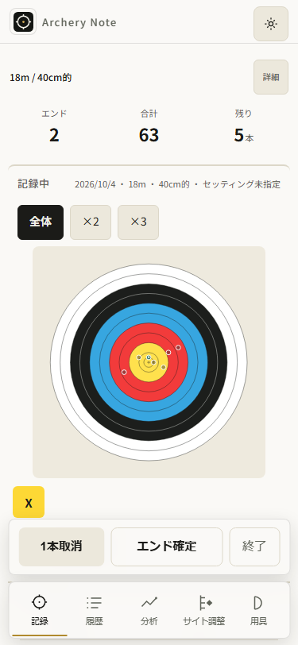
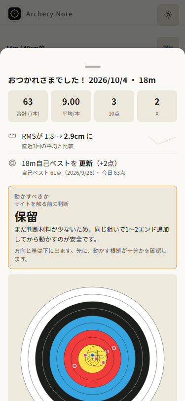

# AN-066 — Native touchからclickが出ない経路を縮小する

前回AN065はv105公開、156テスト、実更新保持と結果画面の改善を完了したprogress。
今回の一小タスクは、所有local rehearsalで終了前にclickが出なかった原因の診断。
既存全承認で進め、架空profileと固定済み104/105の資産だけを使う。
公開やアプリ変更は、診断前に追加しない。

## 手順と受入

1. 元の更新→分析filter→履歴pinch→修正→設定swipe→offline reload→
   履歴→分析focus/select→record→終了を、Escapeなしで再現する。
   正しい終了button上のpointer/touchとclick欠落、保存不変を判定する。
   失敗contextはsnapshot/current livenessの後、明示abortで閉じる。
2. 確定したfeedback loopを縮小する。更新、gesture、offline、filter、focusを
   一変数ずつ取り除き、取消・focus・click・表示とdataを狙って観測する。
   仮説と予測を示してから対照検証する。
3. 原因がharnessなら、実際の入力境界の回帰で誤った操作を修正する。
   原因がappなら、適切なUI regressionのred→greenと元経路再実行が必要。
   元失敗を別contextの成功へ言い換えない。別runの対照は別証拠。
4. 診断と実変更に対応する検証だけ実行する。docsのみならformat:check。
   UIを変えた場合はacceptanceのUI/release行を適用する。
   旧65task/全acceptance、配信25資産、依存/共有lockを保持して記録する。

実iPhone/VoiceOver/INPや、未観測の旧profileの回復は証明しない。
前回の4failed rehearsalとfresh最小4成功を保ち、原因の証拠が揃うまで解決としない。
owned compact-js sandboxを使い、root/original node_modules junctionでinstall/ci/updateしない。

## 診断結果

アプリの終了処理ではなく、自動検証のraw CDP touch入力が起こすChromiumの
flingと、その取消に伴うtap suppressionを特定した。観測ブラウザは149.0.7827.55。
設定を閉じた後の最初のtapはpointer/touch down/upを終了buttonへ届けるが、
clickが出ず、handlerも保存も実行されない。focus/selectだけを原因とはしない。

元の長い104→105更新経路をEscapeなしで再現した。正しい有効button上で
defaultPrevented=false、clickなし、保存不変を記録し、同じ失敗contextを保持。
そのcontextではShift後の二回目のtapで終了でき、旧5件exact・新7矢・6履歴・
active nullを確認して明示abortした。別の縮小対照ではキーを押さず二回目tap
だけでも成功したため、Shiftが回復原因だったとは結論しない。
前回AN065の4失敗profileは既に明示abort済みで、今回回復したとは扱わない。

### 一変数の対照

| 対照                                        | 最初の終了tap       | 根拠                                        |
| ------------------------------------------- | ------------------- | ------------------------------------------- |
| 105で設定raw swipeだけ→終了                 | clickなし、保存不変 | swipe-reduction-105/swipe-no-nav.json       |
| 104で同じraw swipe                          | clickなし、保存不変 | swipe-reduction-104/swipe-no-nav.json       |
| swipeの代わりにmouseで閉じる                | clickあり           | 各swipe-reductionのswipe-mouse-close.json   |
| 元の長い経路から設定swipeだけ除く           | 終了成功            | no-settings-swipe/complete-update.json      |
| 元経路から最後のselectだけ除く              | clickなし           | no-tail-select/observation.json             |
| 元経路から的pinchだけ除く                   | clickなし           | no-target-pinch/observation.json            |
| 小さいHTMLに現addModalSwipeHandleだけ載せる | clickなし           | bare-swipe/original.json                    |
| swipe後のCDP detachを省く                   | clickなし           | bare-session/no-detach.json                 |
| 接続して即detach、swipeなし                 | clickあり           | bare-session/empty-attach-detach.json       |
| 各move間40ms、またはend前200ms停止          | clickあり           | bare-timing-measured/paced.json・dwell.json |
| 元入力の一回目失敗後、キーなし二回目tap     | 二回目だけclickあり | bare-timing-measured/second-tap.json        |

表の相対パスはすべて所有`artifacts/touch-click-v105`内。縮小対照は別runであり、
元の失敗contextの回復証拠ではない。各失敗はsnapshot/data/liveness後に明示cleanup。
`no-handler`という旧実験名はpointerupでのdismissをtouchend後へ延期した試作で、
handler全体の除去ではない。raf延期・capture解放の試作も失敗し、アプリへ採用していない。

bare原入力のtraceにはGestureFlingStart、GestureFlingCancel、FilterTapSuppressionが
あり、paced入力にはこれらがなく最初のclickがある。原swipeのdown→upは約117.9ms、
paced248.8ms、dwell309.5ms。全gestureが1msだったとは扱わない。
Chromiumのtap suppression設計はfling取消後のtapを抑制する説明と一致する。
ソース参照は別revisionで、実149の判定根拠は今回取得したtraceである。
[Chromium TapSuppressionController](https://chromium.googlesource.com/chromium/src/%2B/33d83fbb/components/input/tap_suppression_controller.h)。

## 変更と回帰

変更は`tests/e2e/native-touch.js`と`tests/e2e/modal-swipe-followup.spec.js`。
helperはCDPの`Input.synthesizeScrollGesture`をtouch・110px・800px/s・
`preventFling:true`で実行する。実際にnative gestureでシートを閉じ、アプリhandlerを
直接呼び出さない。[公式CDP Input仕様](https://chromedevtools.github.io/devtools-protocol/tot/Input/)。

320/375の回帰は、設定swipe後に**一回だけ**touchscreenで終了をtapする。
Escape・mouse click・再tapは間に入れない。旧3件exact、新7矢の全座標/採点、
active null、結果表示、閉じるnative tap、reload後の4件保持/errors0を確認。
準備の7矢は所有fixtureであり、この2テストだけでnative矢入力の成功とはしない。
raw入力でred2 failed、helper変更後は既存modal3件も含めgreen5 passed。

元の長い104→105 local rehearsalでも、設定swipe入力だけをこのhelperへ変更し、
同じ更新/filters/history pinch/6矢修正・確定・次矢/的guard/offline SWreload/
分析focus/select/mouse record-tab/**一回のnative終了tap**をEscapeなしで再実行した。
初回15body/canonical14、更新時旧5件exact、終了7矢/6履歴/active null/旧5exact、
結果先行表示/summary swipe/終了後offline SWreload/errors0を確認。
`full-controlled/complete-update.json`の`public:false`が示すとおり、これは所有local対照。
実公開旧profile更新の新しい証拠とは扱わない。

375の画像は検証入力の変更前後を示す。公開アプリUIの変更前後ではない。

| raw入力で終了tapが抑制                                                            | controlled入力で最初の終了tapが成功                                                       |
| --------------------------------------------------------------------------------- | ----------------------------------------------------------------------------------------- |
|  |  |

## 検証出力と保持

所有Node22.19/compact-js sandboxで実行。共有node_modulesではinstall/ci/updateしない。
アプリsource/採点/保存schema/SW activation/依存/versionは不変、v105を維持。
共有hiddenlock SHA256は
`16F9BA6219DA31278CED98C0C742013B4A5AAEA63059E4702E86756702A23309`。

```text
npm run check:all
Storage contract checks OK
Storage round-trip checks OK
Save debounce checks OK
Version alignment checks OK
Distribution checks passed:14 structures/names/order/source/regeneration; gzip JS 196657→139327 bytes; cross-script fixtures

npm run lint
exit 0
npm run format:check
All matched files use Prettier code style!

focused regression: raw helper
2 failed
focused regression: controlled helper + existing modal tests
5 passed (4.9s)

npm run test:e2e:dist (first run)
1 failed / 157 passed (2.0m)
# formStart absent on existing form-diagnostics:471; analysis main empty
npm run test:e2e:dist (sequential run)
158 passed (2.0m)
```

最初の全体runはcheck:distributionのbuildと同じdistを並行使用していた。
最初の失敗出力/error-contextを保持して、書換えを並行させず全158件を再実行した。
失敗の原因を並行buildだと確定した証拠はなく、検証条件の混在を解消した再実行である。
旧Linux配信とのlocal byte比較はindex/manifest/sw/icon/pose JSのCRLF/LF差だけ。
全25件LF正規化一致・14compact JSのexact一致を保存。

source `06e27752a79ec28841dc5a4f03f0672b3dfb34a6`を承認済みmainへpush。
[CI37192326992](https://github.com/eita115115/archery-note/actions/runs/37192326992)は
validate/deploy成功、Linux `158 passed (3.4m)`。実artifact11299646439の26regularfilesを
所有directoryへ安全に展開した。公開25資産/current Linux25資産/前回accepted105の25資産は
全てbyte exact一致。native-readiness.jsonの生成時刻だけはアプリ25資産の外。
アプリ版を上げる変更がないためversion markers105のまま。
`ci-status.json`、`ci-linux.txt`、`linux-public-parity.json`、`public-parity.txt`を保存。

読取専用reviewでP1/P2なし。新回帰はChromium/reduced-motionのみ。
実iPhoneの速いswipe後の最初のtap、VoiceOver/keyboard/INPを保証しない。
他の旧公開失敗profileやWK offline/lifecycle問題は今回の診断では解決していない。
